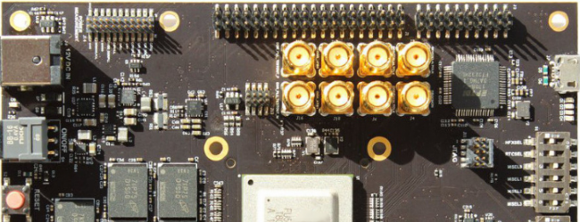

# Welcome to Computer Architecture and Operating Systems

This site contains materials for the "Computer Architecture and Operating Systems" course taught at
[Faculty of Computer Science of Higher School of Economics](https://cs.hse.ru/en/).

For information on course administration, please refer to the
official course [page](http://wiki.cs.hse.ru/ACOS_DSBA_2020/2021) at the university web site.
The official syllabus can be found [here](https://www.hse.ru/edu/courses/375268865).

## Course Motivation

This course is taught to second-year students who major in [data science](https://www.hse.ru/en/ba/data/).
The goal of the course is to give an introduction to how operating systems and hardware work under the hood,
which is essential for general computer science literacy.
This knowledge will help better understand the performance of software systems and create more efficient solutions.
Also, the course will give a starting background to those who are planning to apply machine learning methods
in system software (most of top-ranked IT companies have such projects).
The practical part will give some experience in working with system software such as Unix-based operating systems,
compilers, build tools, emulators, virtual machines, and so on. 

## Course Description

__TODO: CONTENT IS UNDER DEVELOPMENT__ 

The course consists of two logical parts.
The first part is given in __module 3__ and is dedicated to computer architecture and assembly language programming.
This part is based on the [RISC-V](https://en.wikipedia.org/wiki/RISC-V) instruction set architecture
and its assembly language.
The second part is given in __module 4__ and covers foundations of operating system organisation and system programming.
The main tools for this part are the [Linux](https://en.wikipedia.org/wiki/Linux) operating system and
the [C programming language](https://en.wikipedia.org/wiki/C_%28programming_language%29).

### Computer Architecture and Assembly Language

1. [Introduction. Historical overview. Computer architecture and organization.](part1ca/01_Introduction/lecture.md)
   <!--- [CODR] Chapter 1, [MIT 6.172] Lecture 1. [SCO] --> 

2. [Data types. Byte Ordering. Integer formats.](part1ca/02_DataTypes/lecture.md)
   <!--- [CSPP] Chapter 2. -->

3. [Processor. RISC and RISC-V. Assembly language.](part1ca/03_CPU/lecture.md)

4. [Registers and memory. Instruction formats. Arithmetic and load/store instructions.](part1ca/04_Instructions/lecture.md)

5. Conditions, loops, and arrays.

6. Pseudo instructions, macros, and includes.
 
7. Memory-mapped I/O (MMIO).

8. Subroutines. Stack. Calling conventions.

9. [Floating-point format. IEEE 754. Floating-point instructions.](part1ca/09_FP/lecture.md)

10. [Exceptions, traps, and interrupts.](part1ca/10_Exceptions/lecture.md)

11. [Pipelining.](part1ca/11_Pipeline/lecture.md)

12. Caches.

13. Virtual memory.

14. Data-level parallelism: Vector, SIMD, GPU.

15. Thread-level parallelism.

16. Optimizations.

### Operating Systems and System Programming

1. Operating system architecture. Linux.

2. [C programming language. GNU tools (GCC, Make).](part2os/02_C/lecture.md)

3. System calls.

4. [Libraries and binary file format.](part2os/04_Linking/lecture.md)

5. Strings and regular expressions.

6. Processes and threads.

7. Synchronization.

8. Inter-process communication.

9. Filesystem.

10. Devices and other special files.

11. Permissions.

12. [Shell. I/O redirection.](part2os/12_Shell/lecture.md)

13. SystemD services.

14. Sockets.

15. Networking.

16. Distributed operating systems.

17. Virtualization.

18. Security.

19. [High-level languages and operating system.](part2os/19_Python/lecture.md)

## Grading System

Information on the grading system for the course is [here](grades.md).

## Software

The list of software required for the course is [here](software.md). 

## Textbooks

The list of textbooks recommended for reading is [here](books.md).

## Related Courses

The list of similar and related courses is [here](courses.md).

## Acknowledgements

The author would like to thank [George Kouryachy](https://uneex.ru/) who was the first lecturer
of this [course](https://uneex.ru/HSE) and who kindly shared his materials.
Also, thanks to [Alexander Kamkin](https://www.hse.ru/org/persons/209608913)
who was the PhD advisor of the author and who taught him a lot.

## Feedback

If you have any questions or suggestions related to the course content, please feel free to submit
an [issue](https://github.com/andrewt0301/hse-acos-course/issues)
or contact the course [author](https://github.com/andrewt0301). 
If you like the course, you are welcome to star it in
[GitHub](https://github.com/andrewt0301/hse-acos-course).
