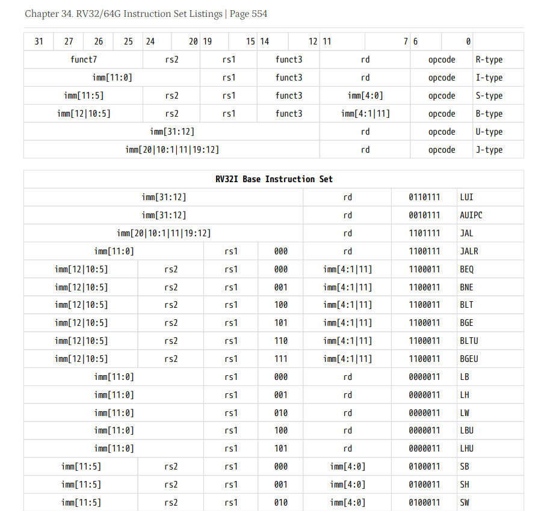
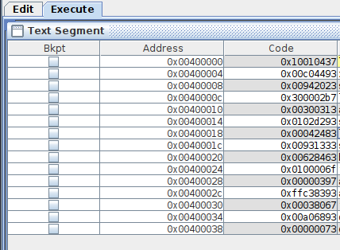

# Lecture 4

# RISC-V Instructions

## Lecture

Slides ([PDF](CA_Lecture_04.pdf), [PPTX](CA_Lecture_04.pptx)).

#### Outline

* Stored program concept.
* Memory layout.
* RISC-V ISA base and extensions.
* Instruction encoding (R, I, S, SB, U, and UJ formats).

## Workshop

#### Outline

* Discuss the tasks from the previous seminar.
* Get familiar with the RISC-V ISA Specification (instruction types, encodings, etc.).
* Practice with encoding and decoding instructions.
* Get familiar with pseudoinstructions.
* Understand the use of labels and branch instructions.
* Practice writing programs with conditions and loops.

#### Tasks

See "Chapter 34. RV32/64G Instruction Set Listings" (page 572) of document ["The RISC-V Instruction Set
Manual Volume I"](https://drive.google.com/file/d/1uviu1nH-tScFfgrovvFCrj7Omv8tFtkp/view?usp=drive_link) to
get instruction encodings.



1. Encode the following instructions to the binary format (see the rules in
   the ISA specification):

   * R-type:

         add  t3, t1, t2

   * I-type:   

         ori  s0, t1, 0x123
         lw   t1, 0x8(t0)
         
   * S-type:
   
         sw   t1, 0x8(t0)

   * SB-type:

         beq t2, t3, 16
         beq t2, t3, -8

   * U-type:
   
         lui  t0, 0x12345

   * UJ-type:

         jal zero, 16

1. Decode the following hexademical values to instructions:

       0x98765437
       0x00744433
       0x0080006f
       0xfff37293
       0x00000463
       0x00032823

1. Get familiar with RISC-V pseudoinstructions (`mv`, `li`, `la`, `b`, `j`, etc).
   What instructions are used to replace them when a program is assembled:

       mv t0, t1
       li t0, 0x12345678
       li t0, 16
       b  label
       j  label
       la t0, label
       
    Note: Add `label` to some place in your code. See what code will be generated in
    the `Execute` panel of RARS. 

1. Write a program that inputs an integer value `x` and prints `-1` if it is negative, `0` if it equals `0`,
   and `1` if it is positive.

   One of possible solutions is this:
   
       main:
           li   a7, 5
           ecall
          
           mv   t0, zero
           beqz a0, done
           li   t0, 1
           blt  zero, a0, done  
           li   t0, -1
       done:
           li a7, 1
           mv a0, t0
           ecall

   Propose any other solution?

1. Write a program that inputs two integer values `x` and `y` and prints first the smallest
   of them and then the largest of them.

## Homework

Decompile the machine-level program provided below.
Convert instructions from the hexadecimal representation into assembly source code.
Put the source code into RARS, assemble and run it.
Ensure that the code is identical to the one provided below (see the picture.



Submit the resulting assembly text into Ejudge (task "RiscvEncoding1").

```
0x10010437
0x00c04493
0x00942023
0x300002b7
0x00300313
0x0102d293
0x00042483
0x00931333
0x00628463
0x0100006f
0x00000397
0xffc38393
0x00038067
0x00a06893
0x00000073
```

## References

* Machine Language. Section 6.4 in [[DDCA]](../../books.md).
* [RISC-V Technical Specifications](https://lf-riscv.atlassian.net/wiki/x/kYD2) (official standards).
* [The RISC-V Instruction Set Manual. Volume I: Unprivileged ISA](
  https://github.com/riscv/riscv-isa-manual/releases/latest) (ongoing drafts).
* [Opcode](https://en.wikipedia.org/wiki/Opcode) (Wikipedia).
* [Addressing Mode](https://en.wikipedia.org/wiki/Addressing_mode) (Wikipedia).
* [C++ library for RISC-V instruction encoding](
  https://github.com/andrewt0301/project_X/blob/main/src/isa/riscv64/riscv64.h) (for illustration).
* [Formal specification of RISC-V ISA](
  https://github.com/andrewt0301/ispras-microtesk-riscv/blob/master/microtesk-riscv/src/main/arch/riscv/model/riscv_rv32i.nml)
  (for illustration).
