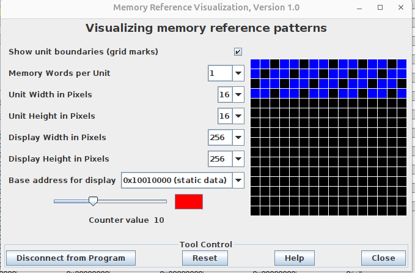
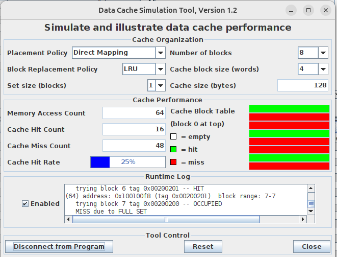

Lecture 8
---

# Memory and caches

## Lecture

Slides ([PDF](CA_Lecture_08.pdf), [PPTX](CA_Lecture_08.pptx)).

#### Outline

* Processor-memory performance gap
* Types of memory devices
* Principle of locality and memory hierarchy
* Cache memory (direct-mapped, set-associative, fully-associative)
* Writing and replacement policies
* Multi-level caches
* Performance considerations

#### Examples

Cache configurations in real CPUs.
Use [lscpu](https://man7.org/linux/man-pages/man1/lscpu.1.html) to get CPU information.
Use AI (e.g. `Core i7-13700 cache size, cache associativity and line size l1 l2 l3 english`)
to summarize cache specifications.

Core i7-13700, 12 cores (Lenovo ThinkCenter):
```
Caches (sum of all):
L1d:                576 KiB (12 instances)
L1i:                384 KiB (12 instances)
L2:                 24 MiB (12 instances)
L3:                 30 MiB (1 instance)
```
Cache specifications:

| Cache Level    | Capacity (Per Core) | Associativity      	| Line Size |
| L1 Data        | 48 KB     	       | 12-way set associative	| 64 bytes  |
| L1 Instruction | 32 KB 	           | 8-way set associative	| 64 bytes  |
| L2 Cache       | 2 MB                | 16-way set associative	| 64 bytes  |
| L3 Cache       | 30 MB (Total Shared)| 12-way set associative	| 64 bytes  |

Core i7-1260P, 8 cores (Huawei MateBook):
```
Caches (sum of all):
L1d:                384 KiB (8 instances)
L1i:                256 KiB (8 instances)
L2:                 10 MiB (8 instances)
L3:                 18 MiB (1 instance)
```
Cache specifications:

| Cache Level    | Capacity (Per Core) | Associativity      	| Line Size |
| L1 Data        | 48 KB     	       | 12-way set associative	| 64 bytes  |
| L1 Instruction | 32 KB 	           | 8-way set associative	| 64 bytes  |
| L2 Cache       | 1.25 MB             | 10-way set associative	| 64 bytes  |
| L3 Cache       | 18 MB (Total Shared)| 12-way set associative	| 64 bytes  |

Core i7-8665U, 4 cores (Lenovo ThinkPad):
```
Caches (sum of all):
L1d:                128 KiB (4 instances)
L1i:                128 KiB (4 instances)
L2:                 1 MiB (4 instances)
L3:                 8 MiB (1 instance)
```
Cache specifications:

| Cache Level    | Capacity (Per Core) | Associativity      	| Line Size |
| L1 Data        | 32 KB	           | 8-way set associative	| 64 bytes  |
| L1 Instruction | 32 KB	           | 8-way set associative	| 64 bytes  |
| L2 Cache       | 256 KB	           | 4-way set associative	| 64 bytes  |
| L3 Cache       | 8 MB (Total Shared) | 16-way set associative	| 64 bytes  |

## Workshop

#### Outline

* Cache types
* RAR Memory Reference Visualization
* RARS Data Cache Simulator
* Playing with cache configurations

#### Examples

Memory Reference Visualization:



Data Cache Simulator:



Linear memory accesses:

```assembly
    .eqv  START 0x10010000
    .eqv  SZ    512
    .text
    li    s0, START
    addi  s1, s0, SZ
loop:
    lw    t0, 0(s0)
    addi  s0, s0, 4
    blt   s0, s1, loop
```

Gaped memory accesses:

```assembly
    .eqv  START 0x10010000
    .eqv  HSZ   256
    # Direct mapping burns out
    # Associative captures
    .text
    li    s0, START
    addi  s1, s0, HSZ
    mv    s2, s1
loop:
    lw    t0, 0(s0)
    lw    t1, 0(s1)
    addi  s0, s0, 4
    addi  s1, s1, 4
    blt   s0, s2, loop
```

Equidistance (try to vary step):

```assembly
    .eqv  START 0x10010000
    .eqv  SZ    256
    .eqv  GAP   3   # Try 5, 11
    .text

    li    s0, START  # start address
    addi  s1, s0, SZ # end address
    li    s2, GAP    # gap in words
    slli  s3, s2, 2  # gap in bytes

    mv    t0, zero
loop_gap:
    slli  t1, t0, 2
    add   t1, s0, t1
loop:
    lw    t2, 0(t1)
 
    add   t1, t1, s3
    blt   t1, s1, loop

    addi  t0, t0, 1
    blt   t0, s2, loop_gap
```

#### Tasks

1. Assume the miss rate of an instruction cache is 2% and the miss rate of the data cache is 4%.
   If a processor has a CPI of 2 without any memory stalls, and the miss penalty is 100 cycles for all misses,
   determine how much faster a processor would run with a perfect cache that never missed.
   Assume the frequency of all loads and stores is 36%.

1. Find the AMAT for a processor with a 1 ns clock cycle time, a miss penalty of 20 clock cycles,
   a miss rate of 0.05 misses per instruction, and a cache access time (including hit detection) of 1 clock cycle.
   Assume that the read and write miss penalties are the same and ignore other write stalls.

1. Use the system with access times of 1, 10, and 100 cycles for the L1 cache, L2 cache, and main memory, respectively. 
   Assume that the L1 and L2 caches have miss rates of 5% and 20%, respectively. 
   Specifically, of the 5% of accesses that miss the L1 cache, 20% of those also miss the L2 cache. 
   What is the average memory access time (AMAT)?

1. Assuming a cache of 4096 blocks, a four-word block size, and a 64-bit address,
   find the total number of sets and the total number of tag bits for caches that are
   direct-mapped two-way and four-way set associative, and fully associative.

1. Try the above examples with following cache configurations (`Tool | Data Cache Simulator`).

   * Placement policy: Direct Mapping / Fully Associative / 2-Way associative
   * Block replacement policy: LRU / Random

   `2×3=6` experiments in total. Report the cache hit rate.

1. Write a program that:
   
   * burns out default fully associative cache with 100% misses;
   * does this in cycle (if previously not);
   * fills only 256 bytes of memory without a gap.

1. Write a program that utilizes memory sparsely, so that its footprint is 100% misses 2-way associative cache.
   However, it fits (almost) into a 4-way associative cache with 16 blocks.

## Homework

Solve the following tasks and submit them into Ejudge:

1. Write a function with label `multiply_matrices:`, which multiplies two matrices of double values
   (i.e. performs the following computation: `C = A * B`).
   The function must accepts the following parameters:
   * `a0` - matrix size (elements in rows and columns);
   * `a1` - A matrix address (input);
   * `a2` - B matrix address (input);
   * `a3` - C matrix address (output).
   The function will be merged with test program [matrix.s](matrix.s) (generates random
   matrises of the given size, multiplies them, and prints the result).

   Input (matrix size):
   ```
   4
   ```

   Output (matrices `A`, `B`, and `C`):
   ```
   -1.0 1.0 1.0 8.0 
   8.0 -5.0 1.0 7.0 
   4.0 -6.0 2.0 -3.0 
   -5.0 -5.0 5.0 9.0 

   -2.0 -4.0 -7.0 -3.0 
   5.0 8.0 -6.0 -4.0 
   5.0 -8.0 7.0 -4.0 
  -4.0 4.0 1.0 7.0 

  -20.0 36.0 16.0 51.0 
  -64.0 -52.0 -12.0 41.0 
  -16.0 -92.0 19.0 -17.0 
  -26.0 -24.0 109.0 78.0
  ```

## References

* Large and Fast: Exploiting Memory Hierarchy. Chapter 5 in [[CODR]](../../books.md#codr).
* Ulrich Drepper. [What Every Programmer Should Know About Memory](
  https://github.com/andrewt0301/hse-acos-course/blob/master/related/cpumemory.pdf).
* [CPU cache](https://en.wikipedia.org/wiki/CPU_cache) (Wikipedia).
* [Memory hierarchy](https://en.wikipedia.org/wiki/Memory_hierarchy) (Wikipedia).
* [Cache hierarchy](https://en.wikipedia.org/wiki/Cache_hierarchy) (Wikipedia).
* [Cache oblivious_algorithm](https://en.wikipedia.org/wiki/Cache-oblivious_algorithm) (Wikipedia).
* [Matrix multiplication algorithm](https://en.wikipedia.org/wiki/Matrix_multiplication_algorithm) (Wikipedia).
