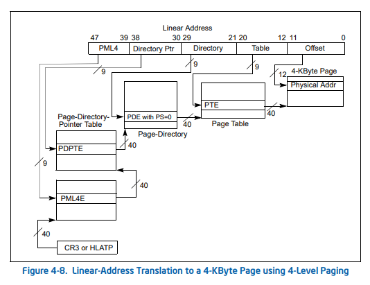
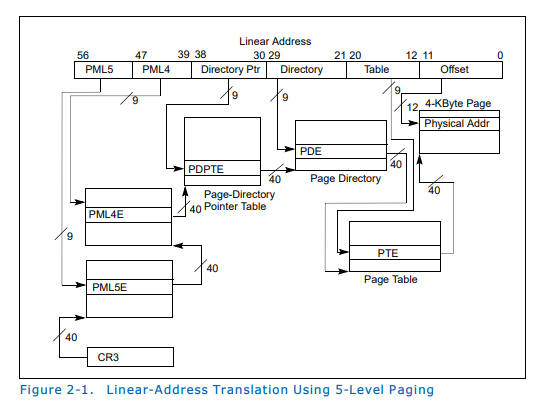
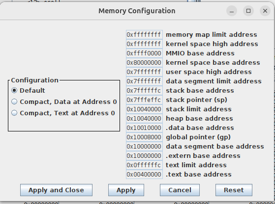
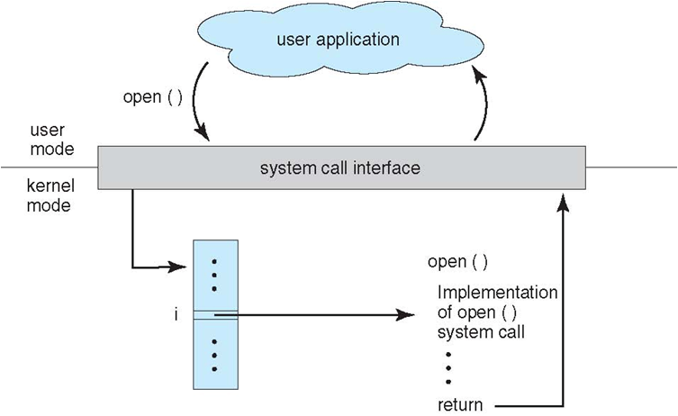

Lecture 9
---

# Virtual Memory

## Lecture

Slides ([PDF](CA_Lecture_09.pdf), [PPTX](CA_Lecture_09.pptx)).

#### Outline

* Virtual memory and physical memory
* Virtual and physical addresses
* Address translation and page table
* Translation lookaside buffer (TLB)

#### Examples

__Address sizes for various real CPUs:__

```
Architecture:             x86_64
CPU op-mode(s):           32-bit, 64-bit
Address sizes:            48 bits physical, 48 bits virtual
Byte Order:               Little Endian
CPU(s):                   24
On-line CPU(s) list:      0-23
Vendor ID:                AuthenticAMD
Model name:               AMD Ryzen AI 9 HX 370 w/ Radeon 890M
```
```
Architecture:             x86_64
  CPU op-mode(s):         32-bit, 64-bit
  Address sizes:          46 bits physical, 48 bits virtual
  Byte Order:             Little Endian
CPU(s):                   24
  On-line CPU(s) list:    0-23
Vendor ID:                GenuineIntel
  Model name:             13th Gen Intel(R) Core(TM) i7-13700
```
```
Architecture:             x86_64
  CPU op-mode(s):         32-bit, 64-bit
  Address sizes:          39 bits physical, 48 bits virtual
  Byte Order:             Little Endian
CPU(s):                   16
  On-line CPU(s) list:    0-15
Vendor ID:                GenuineIntel
  Model name:             12th Gen Intel(R) Core(TM) i7-1260P
```
```
Architecture:             x86_64
  CPU op-mode(s):         32-bit, 64-bit
  Address sizes:          39 bits physical, 48 bits virtual
  Byte Order:             Little Endian
CPU(s):                   8
  On-line CPU(s) list:    0-7
Vendor ID:                GenuineIntel
  Model name:             Intel(R) Core(TM) i7-8665U CPU @ 1.90GHz
```

Modern CPUs are limited to 48-bit virtual addresses because this is more
than enough for modern data volumes (2 ** 48 = 256 TB). Using 48 bits
rather than 64 simplifies hardware (smaller cache tags and TLBs) and page tables.

__Multilevel page tables (Intel)__





__What address types are used for caching?__

| _Cache Level_ |	_Addressing Type_	| _Explanation_ |
| L1 Cache	  | VIPT (Virtually Indexed, Physically Tagged) |	It uses the virtual address for fast indexing while simultaneously performing a TLB lookup to get the physical tag. This allows cache access to start before the address translation is even finished. |
| L2 Cache	  | PIPT (Physically Indexed, Physically Tagged) | This level is addressed entirely by the physical address. It is more accurate for a larger cache but requires the virtual-to-physical translation to be complete before the search begins. |
| L3 Cache	  | PIPT (Physically Indexed, Physically Tagged) | Since L3 is shared across all cores (Smart Cache), it must use physical addresses to maintain consistency between different processes and cores. |

__TLB configuration for i7-8665U__:

Each of the 4 cores has its own dedicated Level 1 TLB and shares a Level 2 TLB: 

* L1 Instruction TLB (iTLB):\
  4 KB Pages: 64 entries (8-way set associative).\
  2 MB / 4 MB Pages: 8 entries (fully associative).

* L1 Data TLB (dTLB):\
  4 KB Pages: 64 entries (4-way set associative).\
  2 MB / 4 MB Pages: 32 entries (4-way set associative).\
  1 GB Pages: 4 entries (4-way set associative).

* L2 Shared TLB (STLB):\
  Large Unified Buffer: 1,536 entries (12-way set associative).\
  This buffer is shared between instructions and data to catch L1 misses. It typically supports 4 KB and 2 MB page sizes.

## Workshop

#### Outline

* Memory configuration (check in different machines)
* Memory layout (RISC-V)
* System calls (pactical tasks)

##### Memory layout in RARS



##### System calls in RARS



_System calls_ are actions requested by user code and serviced by the environment (operating system).
The environment executes the service code in kernel mode (has full access to all resources).
This code handles interaction with a specific device and its driver and returns control back to the user.

###### Standard (provided in all OS) system calls supported by RARS: 

1. __open__ (1024): opens a file with the specified path\
   _Input_: `a0` = Null terminated string for the path, `a1` = flags\
   _Output_: `a0` = the file descriptor or -1 if an error occurred\
   _Supported flags_: _read-only_ (0), _write-only_ (1), and _write-append_ (9).
   The _write-only_ flag creates a file if it does not exist, so it is technically _write-create_.
   The _write-append_ flag will start writing at end of an existing file.

1. __close__ (57): closes a file\
   _Input_: `a0` = the file descriptor to close\
   _Output_: N/A

1. __read__ (63): reads from a file descriptor into a buffer\
   _Input_: `a0` = the file descriptor, `a1` = address of the buffer, `a2` = maximum length to read.\
   _Output_: `a0` = the length read or -1 if error.

1. __write__ (64): writes to a file from a buffer\
   _Input_: `a0` = the file descriptor, `a1` = the buffer address, `a2` = the length to write.\
   _Output_: `a0` = the number of characters written.

1. __sbrk__ (9): allocates heap memory\
   _Input_: `a0` = amount of memory in bytes\
   _Output_: `a0` = address to the allocated block

##### Examples

* [file_write.s](file_write.s) - writing text to a file
* [file_read.s](file_read.s) - reading text from a file
* [heap_alloc.s](heap_alloc.s) - allocating memory in the heap

#### Tasks

1. (_VM_) Consider a virtual memory system that can address a total of 32 GB (`2**35` bytes).
   You have unlimited hard drive space, but are limited to 2 GB (`2**31` bytes) of semiconductor  (physical) memory. Assume that virtual and physical pages are each 4 KB (`2**12` bytes) in size.
   * How many bits is the physical address?
   * What is the maximum number of virtual pages in the system?
   * How many physical pages are in the system?
   * How many bits are the virtual and physical page numbers?
   * How many page table entries will the page table contain?

2. (_Syscalls_) Write a program that creates a copy of the specified file. Input arguments:
   * The name of the source and target files are read from the standard input (use system call 8).
   * The buffer to store data being copied is allocated in the heap (use system call 9).
     The buffer size is specified in standard input.
   * Buffers for storing source and target names are also allocated in the heap (their size is 256 bytes).

## Homework

TODO

## References

* Virtual Memory. Section 8.4 in [[DDCA]](../../books.md#ddca).
* Large and Fast: Exploiting Memory Hierarchy. Chapter 5 in [[CODR]](../../books.md#codr). 
* Ulrich Drepper. [What Every Programmer Should Know About Memory](
  https://github.com/andrewt0301/hse-acos-course/blob/master/related/cpumemory.pdf).
* [Translation lookaside buffer](https://en.wikipedia.org/wiki/Translation_lookaside_buffer) (Wikipedia).
* [Intel 5-level paging](https://en.wikipedia.org/wiki/Intel_5-level_paging) (Wikipedia).
* Intel. [5-Level Paging and 5-Level EPT](intel-5-level-paging-white-paper.pdf).
  White Paper. Revision 1.1. 2017.
* Intel. [Intel® 64 and IA-32 Architectures Software Developer’s Manual Volume 3: System Programming Guide](intel-system-manual.pdf). Chapter 4. Paging. 2022.  
* Intel. [Intel® 64 and IA-32 Architectures Software Developer’s Manual](intel-isa-manual.pdf).
  2024.
