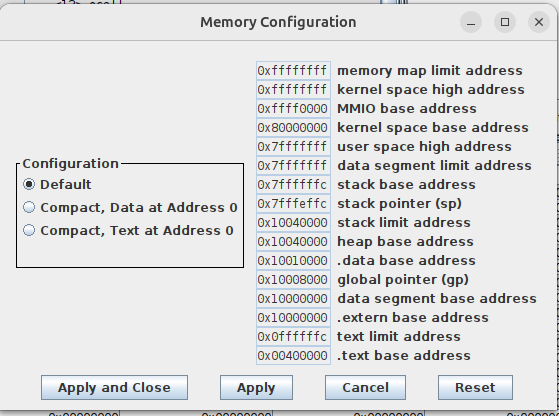
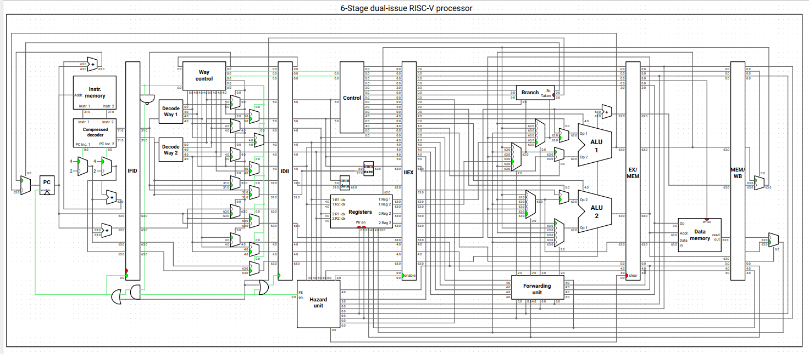
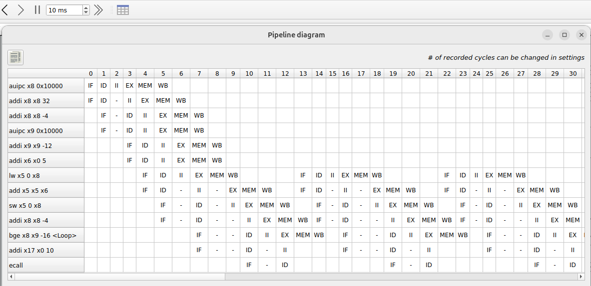
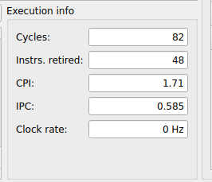
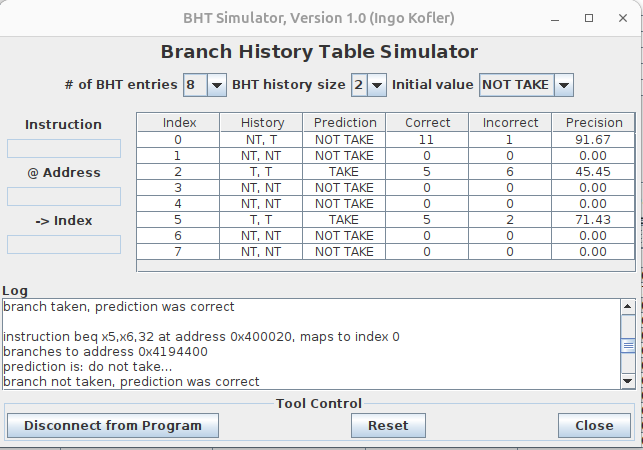

Lecture 13
---

# More instruction-level parallelism. Multiple issue and out-of-order execution.

## Lecture

Slides ([PDF](CA_Lecture_13.pdf), [PPTX](CA_Lecture_13.pptx)).

#### Outline

* Multiple issue processors
* Dynamic and static scheduling
* Out-of-order execution

## Workshop

#### Outline

* System calls in RISC-V (additional topic related to exceptions)
* Working with files and heap allocation
* Experimenting with a 6-stage dual-issue RISC-V processor (use Ripes simulator)
* Experimenting with branch prediction (use RARS simulator) 

##### System calls in RARS (RISC-V Assembly)

System calls are exceptions generated by user code and serviced by the environment (operating system).
The environment executes the service code in kernel mode (has full access to all resources).
This code handles interaction with a specific device and its driver and returns control back to the user.

###### Standard (provided by all OS) system call supported by RARS: 

1. __open__ (1024): opens a file with the specified path\
   _Input_: `a0` = Null terminated string for the path, `a1` = flags\
   _Output_: `a0` = the file descriptor or -1 if an error occurred\
   _Supported flags_: _read-only_ (0), _write-only_ (1), and _write-append_ (9).
   The _write-only_ flag creates a file if it does not exist, so it is technically _write-create_.
   The _write-append_ flag will start writing at end of an existing file.

1. __close__ (57): closes a file\
   _Input_: `a0` = the file descriptor to close\
   _Output_: N/A

1. __read__ (63): reads from a file descriptor into a buffer\
   _Input_: `a0` = the file descriptor, `a1` = address of the buffer, `a2` = maximum length to read.\
   _Output_: `a0` = the length read or -1 if error.

1. __write__ (64): writes to a file from a buffer\
   _Input_: `a0` = the file descriptor, `a1` = the buffer address, `a2` = the length to write.\
   _Output_: `a0` = the number of characters written.

1. __sbrk__ (9): allocates heap memory\
   _Input_: `a0` = amount of memory in bytes\
   _Output_: `a0` = address to the allocated block

#### Examples

* [file_write.s](file_write.s) - writing text to a file
* [file_read.s](file_read.s) - reading text from a file
* [heap_alloc.s](heap_alloc.s) - allocating memory in the heap

#### Dual-Issue RISC-V CPU (Ripes Simulator)

#### Examples

Runs the [add_scalar.s](add_scalar.s) example and see how many CPU clock cycles it uses.

#### Branch History Table (RARS Simulator)

Run programs from lectures 4-7 in RARS simulator with the "Branch History Table" plugin connected.
See how well it can predict branch outcomes with different settings.

#### Tasks

1. Write a program that creates a copy of the specified file. Input arguments:
   * The name of the source and target files are read from the standard input (use system call 8).
   * The buffer to store data being copied is allocated in the heap (use system call 9).
     The buffer size is specified in standard input.
   * Buffers for storing source and target names are also allocated in the heap (their size is 256 bytes).

1. Optimize the [add_scalar.s](add_scalar.s) program to make it waste less CPU cycles.
   Use the loop-unrolling technique (two or more loop iterations merged). How many cycles are used now?

1. Write an optimized version of the [PlusMinus](../Tasks/homeworks.md#plusminus) program that
   avoid the issue incorrect branch prediction with loop unrolling ("even" and "odd" operations must be done
   at the same loop iteration).

## Homework

__TODO__

## References

* Parallelism via Instructions. Section 4.10 in [[CODR]](../../books.md).
* Advanced Microarchitecture. Section 7.7 in [[DDCA]](../../books.md).
* Instruction-Level Parallelism and Its Exploitation. Chapter 3 in [[CAQA]](../../books.md) (Advanced).
* [Superscalar processor](https://en.wikipedia.org/wiki/Superscalar_processor) (Wikipedia).
* [Out-of-order execution](https://en.wikipedia.org/wiki/Out-of-order_execution) (Wikipedia).
* [Register renaming](https://en.wikipedia.org/wiki/Register_renaming) (Wikipedia).
* [Branch predictor](https://en.wikipedia.org/wiki/Branch_predictor) (Wikipedia).
