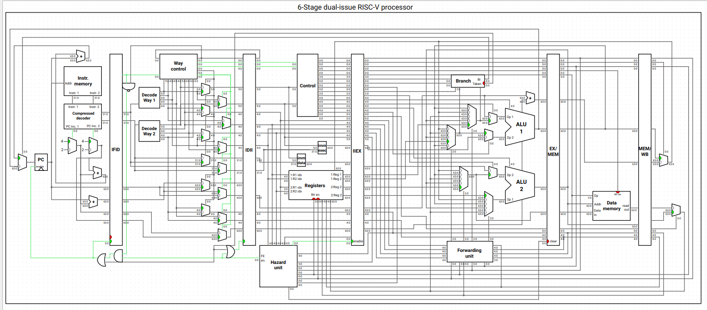
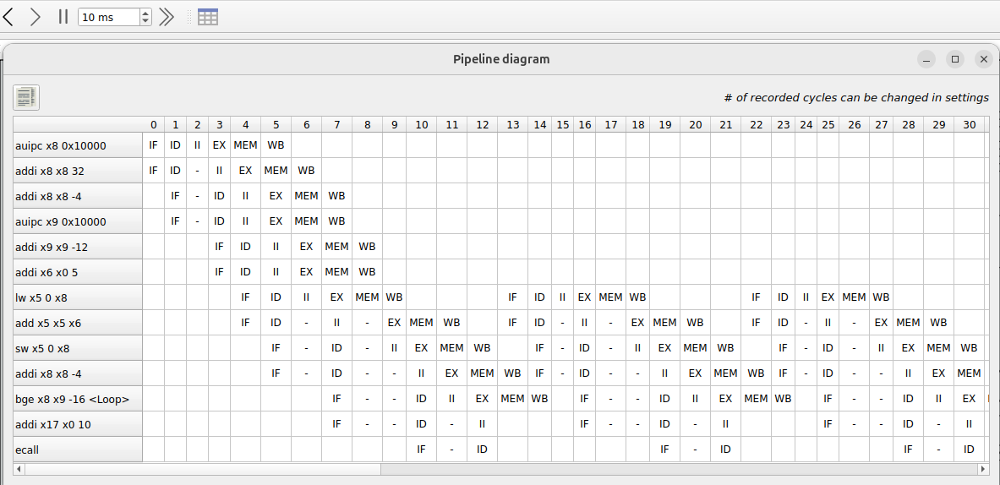
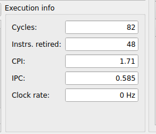
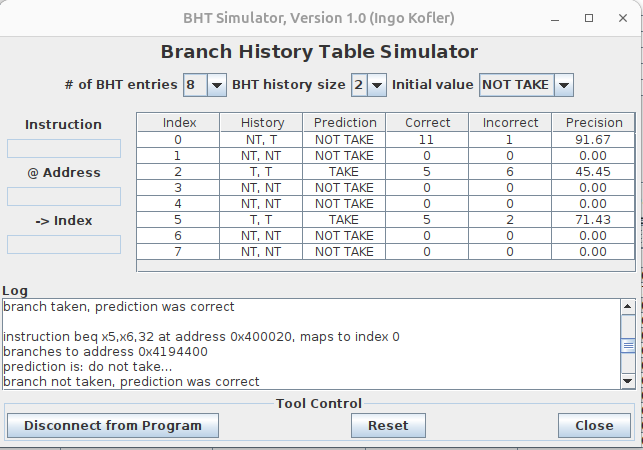

Lecture 13
---

# More instruction-level parallelism. Multiple issue and out-of-order execution.

## Lecture

Slides ([PDF](CA_Lecture_13.pdf), [PPTX](CA_Lecture_13.pptx)).

#### Outline

* Multiple issue processors
* Dynamic and static scheduling
* Out-of-order execution

## Workshop

#### Outline

* Experimenting with a 6-stage dual-issue RISC-V processor (use Ripes simulator)
* Experimenting with branch prediction (use RARS simulator) 

#### Dual-Issue RISC-V CPU (Ripes Simulator)

#### Examples

Runs the [add_scalar.s](add_scalar.s) example and see how many CPU clock cycles it uses.

#### Branch History Table (RARS Simulator)

Run programs from lectures 4-7 in RARS simulator with the "Branch History Table" plugin connected.
See how well it can predict branch outcomes with different settings.

#### Tasks

1. Optimize the [add_scalar.s](add_scalar.s) program to make it waste less CPU cycles.
   Use the loop-unrolling technique (two or more loop iterations merged). How many cycles are used now?

1. Write an optimized version of the [PlusMinus](../Tasks/homeworks.md#plusminus) program, which solves
   the issue of incorrect branch prediction with loop unrolling ("even" and "odd" operations must be done
   at the same loop iteration).

## References

* Parallelism via Instructions. Section 4.10 in [[CODR]](../../books.md#codr).
* Advanced Microarchitecture. Section 7.7 in [[DDCA]](../../books.md#ddca).
* Instruction-Level Parallelism and Its Exploitation. Chapter 3 in [[CAQA]](../../books.md#caqa) (Advanced).
* [Superscalar processor](https://en.wikipedia.org/wiki/Superscalar_processor) (Wikipedia).
* [Out-of-order execution](https://en.wikipedia.org/wiki/Out-of-order_execution) (Wikipedia).
* [Register renaming](https://en.wikipedia.org/wiki/Register_renaming) (Wikipedia).
* [Branch predictor](https://en.wikipedia.org/wiki/Branch_predictor) (Wikipedia).
