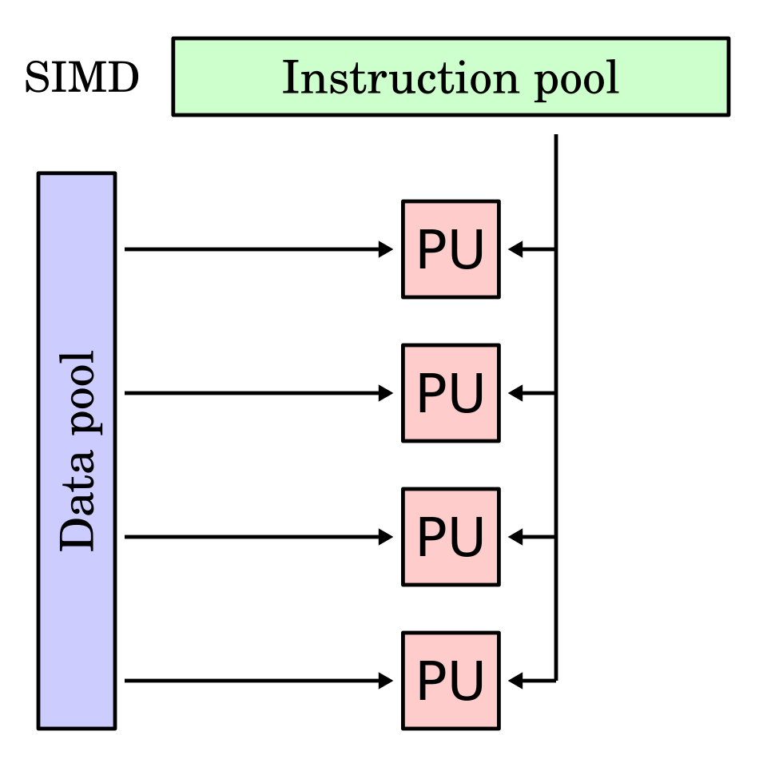
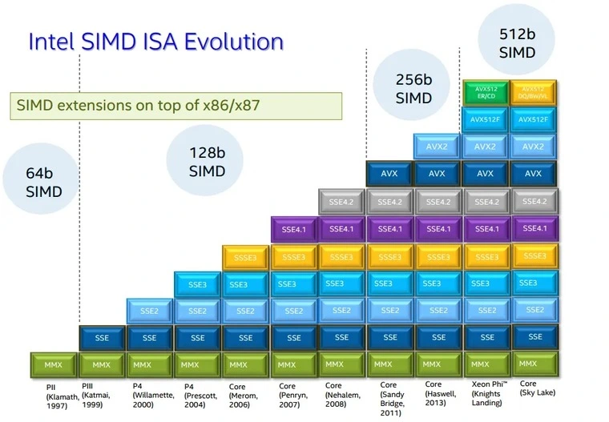

Lecture 16
---

# Data-Level Parallelism

## Lecture

Slides ([PDF](CA_Lecture_16.pdf), [PPTX](CA_Lecture_16.pptx)).

#### Outline

* SIMD Instructions
* Vector Instructions
* GPU



#### Examples

##### AVX (Advanced Vector Extensions for x86-64)



Optimizing DGEMM (Double-precision GEneral Matrix Multiply) using SIMD instructions.

See example [matrix.c](matrix.c). Compile and run it with different versions of DGEMM:
```bash
gcc -o matrix matrix.c -march=native
./matrix
```
Check what AVX extensions are supported:
```bash
lscpu | grep avx
```

Unoptimized version:
```c
void dgemm(int n, double* A, double* B, double* C) {
    for (int i = 0; i < n; ++i) {
        for (int j = 0; j < n; ++j) {
            double cij = C[i+j*n]; /* cij = C[i][j] */
            for (int k = 0; k < n; k++)
                cij += A[i+k*n] * B[k+j*n]; /* cij += A[i][k]*B[k][j] */
            C[i+j*n] = cij; /* C[i][j] = cij */
        }
    }
}
```

AVX2 version (4 doubles at once):
```c
// #include <x86intrin.h>

void dgemm_avx2(int n, double* A, double* B, double* C) {
    for (int i = 0; i < n; i += 4) {
        for (int j = 0; j < n; j++) {
            __m256d c0 = _mm256_load_pd(C+i+j*n); /* c0 = C[i][j] */
            for (int k = 0; k < n; k++)
                /* c0 += A[i][k]*B[k][j] */
                c0 = _mm256_add_pd(c0, _mm256_mul_pd(
                            _mm256_load_pd(A+i+k*n),
                            _mm256_broadcast_sd(B+k+j*n)
                        ));
            _mm256_store_pd(C+i+j*n, c0); /* C[i][j] = c0 */
        }
    }
}
```
AVX512 version (8 doubles at once) - _supported only in AMD and some Intel Xeon processors_:
```c
// #include <x86intrin.h>

void dgemm_avx512(int n, double* A, double* B, double* C) {
    for (int i = 0; i < n; i += 8) {
        for (int j = 0; j < n; j++) {
            __m512d c0 = _mm512_load_pd(C+i+j*n); /* c0 = C[i][j] */
            for (int k = 0; k < n; k++)
                /* c0 += A[i][k]*B[k][j] */
                c0 = _mm512_add_pd(c0, _mm512_mul_pd(
                            _mm512_load_pd(A+i+k*n),
                            _mm512_broadcastsd_pd(_mm_load_sd(B+k+j*n))
                        ));
            _mm512_store_pd(C+i+j*n, c0); /* C[i][j] = c0 */
        }
    }
}
```

## Workshop

#### Outline

* Using RISC-V 64-bit instructions to simulate vector operations

#### Examples

* [add_vector.s](add_vector.s)

_NOTE_:
The `ld` and `sd` instructions are 64-bit load and store correspondingly.
They are available in the 64-bit version of RISC-V and 64-bit mode of RARS.
To enable 64-bit mode in RARS, tick the checkbox in the `Setting | 64-bit` menu item.
This will make all general-purpose registers 64-bit wide.
The `ld` and `sd` instructions work in the same way as `lw` and `sw`,
the only difference is the data size that becomes 64 bits (or 8 bytes).
See the "Chapter 7. RV64I Base Integer Instruction Set" in the [RISC-V instruction set manual](
https://github.com/riscv/riscv-isa-manual/releases/latest) for details.

#### Tasks

1. Write a program that inputs an integer value `N`, inputs 2 matrices of size 4 * `N`,
  adds the two matrices, and prints the resulting matrix. Each element of a matrix is a byte value.
  Elements of the matrices are added by `4`, to simulate vector operations.
  _Hint:_ Use the `lw` and `sw` instructions to load and store 4 elements at once.

1. Implement function DAXPY (double-precision `Y = a × X + Y`) using Intel VX2 instristics
   (256-bit operations). Check the correctness by comparing with a simple implementation (without SIMD).

__TODO__: More tasks

## References

* [Flynn's taxonomy](https://en.wikipedia.org/wiki/Flynn%27s_taxonomy) (Wikipedia).
* AVX instructions in x86. Sections 3.7 and 3.8 in [[CODR]](../../books.md#codr).
* SISD, MIMD, SIMD, SPMD, and Vector. Section 6.3 in [[CODR]](../../books.md#codr).
* Data-Level Parallelism in Vector, SIMD, and GPU Architectures. Chapter 4 in [[CAQA]](../../books.md#caqa).
* Algorithmica / HPC. [SIMD Parallelism](https://en.algorithmica.org/hpc/simd/).
* Christopher Woods. [Efficient Vectorisation with C++](https://chryswoods.com/vector_c++/README.html).
* Chapter 31. "V" Standard Extension for Vector Operations in
  [RISC-V instruction set manual](https://github.com/riscv/riscv-isa-manual/releases/latest).
* [RISC-V Vector Intrinsic Document](https://github.com/riscv-non-isa/rvv-intrinsic-doc).
* [Programming with RISC-V Vector Instructions](https://gms.tf/riscv-vector.html).
* [Intrinsic function](https://en.wikipedia.org/wiki/Intrinsic_function) (Wikipedia).
* [Mirror of Intel® Intrinsics Guide](https://www.laruence.com/sse/).
* Intel's [Advanced Vector Extensions](https://en.wikipedia.org/wiki/Advanced_Vector_Extensions) (Wikipedia).
