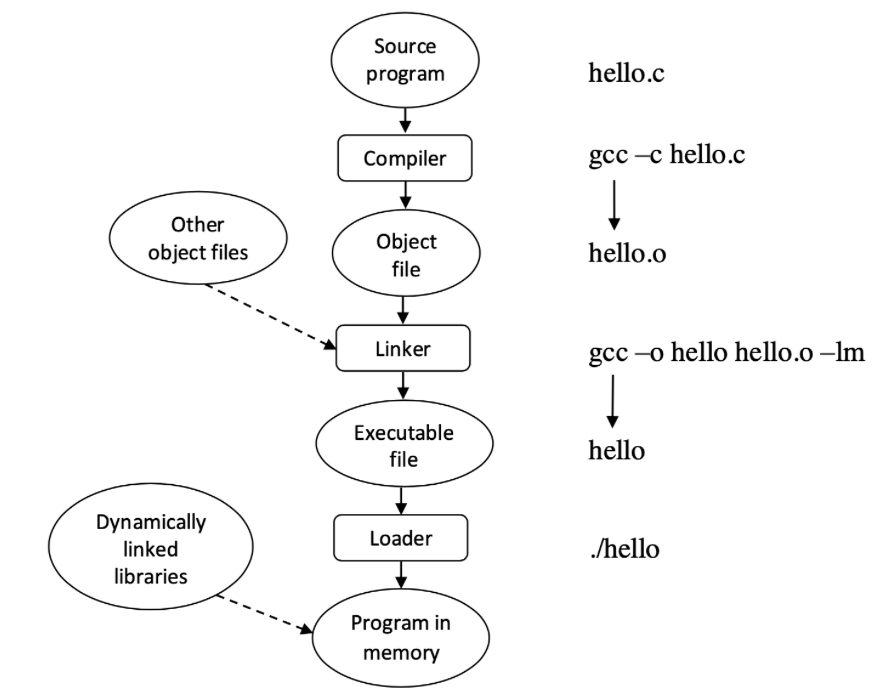

Static and Shared Libraries 
---

### Linking and Loading



Programs are stored on disk as binary executable files (e.g. _hello_).
To be run, a program must be loaded into memory and placed into the context of a process.

Source files are compiled by the _compiler_ into _object files_ that are designed to be loaded into any physical location.
This format is called _relocatable object file_.
 
Next, the _linker_ combines these files to produce a single binary _executable file_.
During the linking stage, external library object files are included as well
(e.g. the standard C or math library specified as `–lm`).

When a program is run, the executable file and all necessary
libraries are loaded into memory with the help of the _loader_.
There two kinds of libraries: _static_ and _shared_ (also called dynamic).
Code from static libraries is included into the executable file by the linker.
Shared libraries are loaded into the process of the program by the loader.
If multiple executable files being run use the same shared library,
the library is shared among their processes using shared memory facilities provided by the operating system.
On the contrary, static libraries are linked into each executable file that uses them.
So, each program has its own copy.

Object and executable files have standard formats that cover compiled machine code and a symbol
table containing metadata about functions and variables that are referenced in the program.
Linux uses the standard format called [ELF](https://man7.org/linux/man-pages/man5/elf.5.html)
(Executable and Linkable Format). There are separate ELF formats for executable and relocatable files.
The most important information about an executable file is its _entry point_,
which is the address of the first instruction to be executed when the program runs.

In Linux, the format of a file can be determined with the help of the
[file](https://man7.org/linux/man-pages/man1/file.1.html) utility.
For example:

```bash
acos@acos-vm:~$ file hello.c
hello.c: C source, ASCII text
acos@acos-vm:~$ file hello.o 
hello.o: ELF 64-bit LSB relocatable, x86-64, version 1 (SYSV), not stripped
acos@acos-vm:~$ file hello
hello: ELF 64-bit LSB shared object, x86-64, version 1 (SYSV), dynamically linked, interpreter /lib64/ld-linux-x86-64.so.2, BuildID[sha1]=80ddf1c9cd9f91062b9fcec9c16fbacd3a24f408, for GNU/Linux 3.2.0, not stripped
```

### Simple application

The 'hello.c' listing:

```c
#include <stdio.h>
#include <stdlib.h>

int main()
{
  printf("Hello World\n");
  exit(0);
}
```

To compile, execute this:

    acos@acos-vm:~$ gcc hello.c -o hello
    
To run, execute this:

    acos@acos-vm:~$./hello
    Hello World

### Static and shared libraries

Let us have a closer look at the two library types and how they are created and included into a program. 

* Static - `.a` extension
* Shared - `.so` extension

Names of libraries start with the lib prefix.
 
The Linux operating system includes a large set of standard system libraries.
To see the full list of these libs, execute the command:
    
    acos@acos-vm:~$ ls /usr/lib | less

To list of libraries loaded by a program, use the [ldd](https://man7.org/linux/man-pages/man1/ldd.1.html) command.
For example:

    acos@acos-vm:~$ ldd "$(which ls)"
 
#### Static libraries

Use `mcedit` to create the `fred.c` and `bill.c` files.

__fred.c:__

    mcedit fred.c

```c
#include <stdio.h>

void fred(int arg)
{
   printf("fred: you passed %d\n", arg);
}

```

__bill.c:__

    mcedit bill.c

```c
#include <stdio.h>

void bill(char *arg)
{
   printf("bill: you passed %s\n", arg);
}

```

Compile the sources into object files:

    gcc -c fred.c bill.c

See the object files:

    ls *.o
    bill.o
    fred.o

Make a static library (archive):

    ar crv libfoo.a bill.o fred.o
    r - bill.o
    r - fred.o

Write the header file for the library:

__lib.h:__

    mcedit lib.h 

```c
void bill(char *);
void fred(int);
```

Write a program that uses the library:

__program.c__:

    mcedit program.c
    
```c 
#include <stdlib.h>
#include "lib.h"

int main()
{
  bill("Hello World!");
  exit(0);
}
```

Build the program object file:

    gcc -c program.c

Build a program from object files:

    gcc -o program program.o bill.o  

Build a program that used the static library:

    gcc -o program program.o -L. -lfoo

#### Shared libraries

Compile the sources into [position-independent code](https://en.wikipedia.org/wiki/Position-independent_code) (PIC).
The `–Wall` flag enables compiler warnings (help avoid errors):

    acos@acos-vm:~$ gcc -c -Wall -fPIC fred.c bill.c

Build shared library from object files:

    acos@acos-vm:~$ gcc -shared -o libfoo.so fred.o bill.o

Build the program that uses the shared library: 

    acos@acos-vm:~$ gcc -Wall -o program program.c -lfoo -L.

Run the program (the [LD_LIBRARY_PATH](https://man7.org/conf/lca2006/shared_libraries/slide3d.html)
variable set path to shared libraries):

    acos@acos-vm:~$ export LD_LIBRARY_PATH=.
    acos@acos-vm:~$ ./program

The libraries loaded into a process can be viewed with the help of
the [ldd](https://man7.org/linux/man-pages/man1/ldd.1.html) utility:

    acos@acos-vm:~$ ldd ./program
