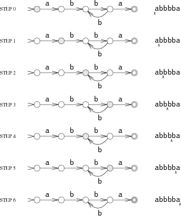

Regular Expression
---



Narrowest [Chomsky_hierarchy](https://en.wikipedia.org/wiki/Chomsky_hierarchy) formal language class:

* Can be (relatively) easily parsed
* Can describe almost any possible pattern, not bound to context and having no internal parts dependence
  (e. g. «a if precedes by b» or «integer number, than that number of characters» _can not_ be described)
* Laconic

__Warning: To write a regexp is far easier than to read other's regexp.__

Examples of regular expressions can be found [here](regexes_ex.md).
For experiments with regular expressions, the [regex101](https://regex101.com) site can be used.

### Regexp Tools

1. Find. [grep](http://man7.org/linux/man-pages/man1/grep.1.html): filtering strings that contain regexp:

   ```bash
   $ cal | grep 18
   16 17 18 19 20 21 22
   $ cal | grep '9.*4'
   9 10 11 12 13 14 15
   ```
   * (!) try all examples above via `grep` (happily it colors all substring matches)
   * `vim` (command enter command-line mode)
       * `/regexp`: search forward
       * `?regexp`: search backward
   * `less` — same
   * ...

1. Search and replace. [sed](https://man7.org/linux/man-pages/man1/sed.1.html): stream editor.

   * Search and replace: `s/regexp/replacement`
       * Replace once
       ```bash
       $ cal | sed 's/[12][23]/@@/' 
              March 2020     
       Su Mo Tu We Th Fr Sa
        1  2  3  4  5  6  7
        8  9 10 11 @@ 13 14
       15 16 17 18 19 20 21
       @@ 23 24 25 26 27 28
       29 30 31            
       ``` 
       * Replace all (___g___lobally)
       ```bash
       $ cal | sed 's/[12][23]/@@/g'
           March 2020     
       Su Mo Tu We Th Fr Sa
        1  2  3  4  5  6  7
        8  9 10 11 @@ @@ 14
       15 16 17 18 19 20 21
       @@ @@ 24 25 26 27 28
       29 30 31
       ```
   * Group recall: every substring matched regexp grouped by "`\(`"/"`\)"
     can be inserted into replacement string by referencing to corresponded number ("`\1`", "`\2`" etc):
     ```bash
     $ cal | sed 's/2\([0-6]\)/=\1/g'
          March =0=0     
     Su Mo Tu We Th Fr Sa
      1  2  3  4  5  6  7
      8  9 10 11 12 13 14
     15 16 17 18 19 =0 =1
     =2 =3 =4 =5 =6 27 28
     29 30 31
     $ echo '15 16 17 18 19 20 21' | sed 's/\(15\)\(.*\)\(20\)/\3\2\1/'
     20 16 17 18 19 15 21
     $ echo '==15 16 17 18 19 20 21==' | sed 's/\([0-9][0-9]*\).*\([0-9]\)/\1\2/'
     ==151==
     $ echo '==15 16 17 18 19 20 21==' | sed 's/\([0-9]*\).*\([0-9]\)/\1\2/' 
     1==
     ```
     * (!) check [[#complex]] examples with `sed`
     * Groups are numbered by the _opening  parenthesis_ order:
       ```bash
       $ echo 'aaabbbccc' | sed 's/\(a*\(b*\)\)/\2-\1=/'
       bbb-aaabbb=ccc
       $ echo '15 16 17 18 19 20 21' | sed 's/\(1.*7.*\(8.*2\)\)/\2-\1=/'
       8 19 20 2-15 16 17 18 19 20 2=1
       ```

1. Text editor. `vim`: same as `sed`, but plus:
    * "`:s/regexp/replacement/`" — replace once in current line
    * "`:s/regexp/replacement/g`" — replace all (globally) in current line
    * "`:%s/regexp/replacement/g`" — replace all in the while file
    * "`:10,30s/regexp/replacement/g`" — replace all in 10, 11, …, 30 line
    * "`:/BEGIN/,/END/s/regexp/replacement/g`" — replace all in lines started from line contains `BEGIN` to the line contains `END`
    * "`:/main(/,/^}/s/'\([^']*\)'/"\1"/g`" — replace all «`'...'`» strings (wich are _not_ in C :) ) to «`"..."`» (which are) in function `main()`
    * "`:/main(/,/^}/s/'\([^']*\)'/"\1"/gc`" — do the same with _confirmation_ of each replacement

### Regexp in C language

The C language provides library functions to deal with regular expressions declared in the `<regex.h>` header.
See details [here](https://man7.org/linux/man-pages/man3/regcomp.3.html). Main functions:

* `regcomp` - compiles a regular expression;
* `regexec` - performs a search for the specified regular expression in a string;
* `regfree` - frees the compiled regular expression.

The example below takes two command-line arguments
(regular expression `arv[1]` and `argv[2]` text) and checks whether they match. 

Command:
```bash
tatarnikov@akos:~$ ./regex2 "^H.*s$" "Higher School of Economics"
'Higher School of Economics' matches '^H.*s$'
tatarnikov@akos:~$ ./regex2 "^H.*s$" "Higher School of Economics_"
'Higher School of Economics_' mismatches '^H.*s$'
tatarnikov@akos:~$
```
Code:
```c
#include <stdint.h>
#include <stdio.h>
#include <stdlib.h>
#include <regex.h>

int match(const char *string, char *pattern) {
    int    status;
    regex_t    re;

    if (regcomp(&re, pattern, REG_EXTENDED|REG_NOSUB) != 0) {
        return 0;
    }
    status = regexec(&re, string, (size_t) 0, NULL, 0);
    regfree(&re);
    if (status != 0) {
        return 0;
    }
    return 1;
}

int main(int argc, char *argv[]) {
    char* regex = argv[1];
    char* name = argv[2];
    if (match(name, regex)) {
        printf("'%s' matches '%s'\n", name, regex);
    } else {
        printf("'%s' mismatches '%s'\n", name, regex);
    }
    return 0;
}
```

The example below finds all matches of the specified regular expression in the specified text:
```c
#include <stdint.h>
#include <stdio.h>
#include <stdlib.h>
#include <regex.h>

#define ARRAY_SIZE(arr) (sizeof((arr)) / sizeof((arr)[0]))

static const char *const str =
       "1) John Driverhacker;\n2) John Doe;\n3) John Foo;\n";
static const char *const re = "John.*o";

int main(void) {
   static const char *s = str;
   regex_t     regex;
   regmatch_t  pmatch[1];
   regoff_t    off, len;

   if (regcomp(&regex, re, REG_NEWLINE))
       exit(EXIT_FAILURE);

   printf("String = \"%s\"\n", str);
   printf("Matches:\n");

   for (int i = 0; ; i++) {
       if (regexec(&regex, s, ARRAY_SIZE(pmatch), pmatch, 0))
           break;

       off = pmatch[0].rm_so + (s - str);
       len = pmatch[0].rm_eo - pmatch[0].rm_so;
       printf("#%d:\n", i);
       printf("offset = %jd; length = %jd\n", (intmax_t) off, (intmax_t) len);
       printf("substring = \"%.*s\"\n", len, s + pmatch[0].rm_so);

       s += pmatch[0].rm_eo;
   }
   exit(EXIT_SUCCESS);
}
```
