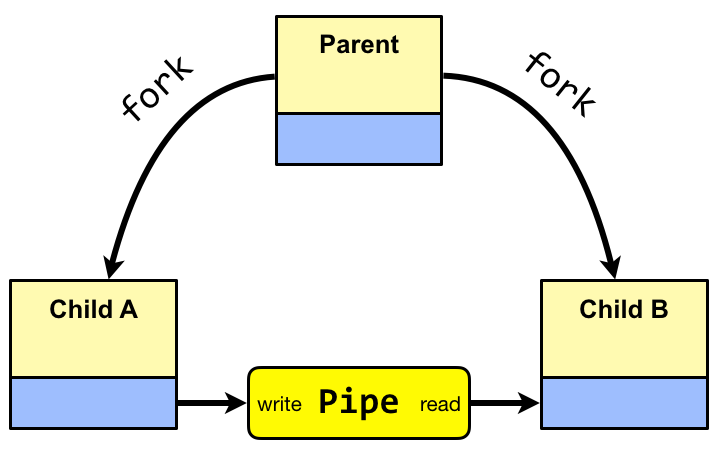

Lecture 6
---

# Processes and Threads

## Lecture

Slides ([PDF](OS_Lecture_06.pdf), [PPTX](OS_Lecture_06.pptx)).

## Workshop

### Processes

Modern operating systems run programs in an isolated context called a process.
Each process has its own address space,
where it stores the code of the executed program and data the program operates with.
A process is typically run by double-clicking a program or by executing a command-line command (`./program`).
The operating system switches between processes to give a user possibility to interact
with several programs and to give a feeling of concurrent execution of programs
(multicore processors allow executing multiple processes in parallel, but this parallelism is limited
by the number of cores).

In Linux, the list of the currently running processes can be viewed
with the help of the [ps](https://man7.org/linux/man-pages/man1/ps.1.html) utility:
```bash
acos@acos-vm:~$ ps -ef
```

Another useful utility is [top](https://man7.org/linux/man-pages/man1/top.1.html).
It provides a dynamic view on running processes and resources allocated by the operating system.

Linux also includes the `/proc` virtual file system,
which provides information on running processes and other feature of the system
in the form of virtual folders and files.
For example, it is possible to get information in the version of the currently running Linux:
```bash
acos@acos-vm:~$ cat /proc/version

Linux version 5.4.0-52-generic (buildd@lgw01-amd64-060) (gcc version 9.3.0 (Ubuntu 9.3.0-17ubuntu1~20.04)) #57-Ubuntu SMP Thu Oct 15 10:57:00 UTC 2020
```
Each process is assigned a unique process identifier (PID), which is an integer number.
It allows addressing a specific process running in the system.

For example, the process of the Shell terminal used in these examples has an identifier equal to `2134`.
```bash
acos@acos-vm:~$ ps
PID TTY TIME CMD
  2134 pts/0 00:00:00 bash
  2297 pts/0 00:00:00 ps
```

### Environment Variables

Each process maintains a list of environment variables loaded when the process starts.

The list of environment variables defined in the system can be printed with the
[printenv](https://man7.org/linux/man-pages/man1/printenv.1.html) utility:

```bash
tatarnikov@akos:~/lab_proc$ printenv
SHELL=/bin/bash
PWD=/home/tatarnikov/lab_proc
LOGNAME=tatarnikov
HOME=/home/tatarnikov
LESSCLOSE=/usr/bin/lesspipe %s %s
XDG_SESSION_CLASS=user
TERM=xterm
PATH=/usr/local/sbin:/usr/local/bin:/usr/sbin:/usr/bin:/sbin:/bin:/usr/games:/usr/local/games:/snap/bin
DBUS_SESSION_BUS_ADDRESS=unix:path=/run/user/1001/bus
SSH_TTY=/dev/pts/0
OLDPWD=/home/tatarnikov
_=/usr/bin/printenv
```

Environment variables can be accessed in C program via
the [environ](https://man7.org/linux/man-pages/man7/environ.7.html) global variable:
```c
#include <stdio.h>
#include <stdlib.h>

extern char **environ;

int main(int argc, char *argv[]) {
    char **ep;
    for (ep = environ; *ep != NULL; ep++)
        puts(*ep);
    exit(EXIT_SUCCESS);
}
```

Also, the following functions for handling environment variables
are provided in the `<stdlib.h>` header:

* [getenv](https://man7.org/linux/man-pages/man3/getenv.3.html)
* [putenv](https://man7.org/linux/man-pages/man3/putenv.3.html)
* [setenv](https://man7.org/linux/man-pages/man3/setenv.3.html)
* [unsetenv](https://man7.org/linux/man-pages/man3/unsetenv.3p.html)
* [clearenv](https://man7.org/linux/man-pages/man3/clearenv.3.html)

### Exit Handlers

The [atexit](https://man7.org/linux/man-pages/man3/atexit.3.html)
and [on_exit](https://man7.org/linux/man-pages/man3/on_exit.3.html) functions can be used
to register exit handlers:

```c
#include <stdlib.h>
#include <stdio.h>

static void atexitFunc1(void) {
    printf("atexit function 1 called\n");
}

static void atexitFunc2(void) {
    printf("atexit function 2 called\n");
}

static void onexitFunc(int exitStatus, void *arg) {
    printf("on_exit function called: status=%d, arg=%ld\n", exitStatus, (long) arg);
}

int main(int argc, char *argv[]) {
    if (on_exit(onexitFunc, (void *) 10) != 0)
        perror("on_exit 1");
    if (atexit(atexitFunc1) != 0)
        perror("atexit 1");
    if (atexit(atexitFunc2) != 0)
        perror("atexit 2");
    if (on_exit(onexitFunc, (void * ) 20) != 0)
        perror("on_exit 2");

    exit(2);
}
```

### Managing Processes

Linux provides system calls for managing process.
The most important of them is [fork](https://man7.org/linux/man-pages/man2/fork.2.html).
It creates a new process by duplicating the calling process.
The new process is called the _child process_, while the current process is called the _parent process_.
The processes run in separate memory.
However, at the time of calling fork, both memory spaces have the same content.

To run a different program in the newly created process (and, thus, to update memory),
the [exec](https://man7.org/linux/man-pages/man3/exec.3.html) system call is used.

Another useful system call is [wait](https://man7.org/linux/man-pages/man2/wait.2.html),
which allows the parent process to wait for the child process to change state (e.g. terminate).

The example below runs the `ls` utility in a separate child process:

```c
#include <sys/types.h>
#include <stdio.h>
#include <unistd.h>

int main() {
    pid_t pid;
    // fork a child process
    pid = fork();
    if (pid < 0) { // error occurred
        perror("Fork Failed");
        return 1;
    } else if (pid == 0) { // child process
        execlp("/bin/ls", "ls", NULL);
    } else { // parent process
        // parent will wait for the child to complete
        wait(NULL);
        printf("Child Complete");
    }
    return 0;
}
```

### Input and Output Redirection

A process has 3 files associated with the streams `stdin`, `stdout`, and `stderr`:

|Stream	         | ID              |  Descriptor  |
|Standard Input  | `STDIN_FILENO`  | `0`          |
|Standard Output | `STDOUT_FILENO` | `1`          |
|Standard Error  | `STDERR_FILENO` | `2`          |

Here is an example of using these descriptors for output:
```c
#include <unistd.h>

int main () {
    write(STDOUT_FILENO, "STD\n", 5);
    write(STDERR_FILENO, "ERR\n", 5);
    return 0;
}
```

It is possible to redirect a standard stream to a file.

Output:

```bash
tatarnikov@akos:~$ echo "Hello World" > out.txt
tatarnikov@akos:~$ cat out.txt
Hello World
```

Input:

```bash
tatarnikov@akos:~$ read a b < out.txt
tatarnikov@akos:~$ echo "$a $b"
Hello World
```

In C language, this can be done using the [open](https://man7.org/linux/man-pages/man2/openat.2.html),
[close](https://man7.org/linux/man-pages/man2/close.2.html) and
[dup2](https://man7.org/linux/man-pages/man2/dup.2.html) system calls.

For example:

```c
#include <unistd.h>
#include <sys/types.h>
#include <sys/stat.h>
#include <fcntl.h>

int main(int argc, char *argv[]) {
    char* const command = argv[1];
    char* const out = argv[2];

    switch (fork()) {
       case -1: {
           return -1;
       }
       case 0: {
           int fd = open(out, O_CREAT|O_WRONLY|O_TRUNC, S_IRUSR|S_IWUSR);
           close(STDOUT_FILENO);
           dup2(fd, STDOUT_FILENO);
           execlp(command, command, NULL);
           break;
       }
       default: {
           wait(NULL);
           break;
       }
    }
    return 0;
}
```

### Connecting Processes with a Pipe



Output of one process can be used as input of another.
For example, an output of `ls` (list directory) can be used as an input for `wc` (word count).

```bash 
tatarnikov@akos:~$ ls | wc -l 
```

The two processes are connected via [pipe](https://man7.org/linux/man-pages/man2/pipe.2.html), a FIFO kernel buffer.
In C, the same functionality can be implemented as follows:


```c
#include <unistd.h>
#include <sys/wait.h>
#include <stdio.h>
#include <stdlib.h>

void errExit(const char* err) {
    perror(err);
    exit(EXIT_FAILURE);
}

int main(int argc, char *argv[]) {
    int pfd[2];  /* Pipe file descriptors */

    if (pipe(pfd) == -1) /* Create pipe */
        errExit("pipe");

    switch (fork()) {
        case -1:
            errExit("fork");

        case 0:  /* First child: exec 'ls' to write to pipe */
            if (close(pfd[0]) == -1)  /* Read end is unused */
                errExit("close 1");

            /* Duplicate stdout on write end of pipe; close duplicated descriptor */

            if (pfd[1] != STDOUT_FILENO) {  /* Defensive check */
                if (dup2(pfd[1], STDOUT_FILENO) == -1)
                    errExit("dup2 1");
                if (close(pfd[1]) == -1)
                    errExit("close 2");
            }

            execlp("ls", "ls", (char *) NULL);  /* Writes to pipe */
            errExit("execlp ls");

        default:  /* Parent falls through to create next child */
            break;
    }

    switch (fork()) {
        case -1:
            errExit("fork");

        case 0:  /* Second child: exec 'wc' to read from pipe */
            if (close(pfd[1]) == -1)  /* Write end is unused */
                errExit("close 3");

            /* Duplicate stdin on read end of pipe; close duplicated descriptor */
            if (pfd[0] != STDIN_FILENO) {  /* Defensive check */
                if (dup2(pfd[0], STDIN_FILENO) == -1)
                    errExit("dup2 2");
                if (close(pfd[0]) == -1)
                    errExit("close 4");
            }

            execlp("wc", "wc", "-l", (char *) NULL);
            errExit("execlp wc");

        default: /* Parent falls through */
            break;
    }

    /* Parent closes unused file descriptors for pipe, and waits for children */

    if (close(pfd[0]) == -1)
        errExit("close 5");
    if (close(pfd[1]) == -1)
        errExit("close 6");
    if (wait(NULL) == -1)
        errExit("wait 1");
    if (wait(NULL) == -1)
        errExit("wait 2");

    exit(EXIT_SUCCESS);
}
```

## Tasks

1. Write a program called `fork.c` that creates a child process and waits for it to complete.
   The child process creates another child process and waits for it to complete.
   Each of the processes prints a message that identifies it (e.g. “Hello from Parent”).

<!--
1. Write a program that runs a command specified as a command-line arguments.
   If the command has arguments itself, the arguments must be forwarded to the command.
   See documentation on the [exec](https://man7.org/linux/man-pages/man3/exec.3.html)
   system call. 
-->

Write the following programs.

1. `outredir.c` command output_filename, execs a command with stdout redirected to output_filename
   
   e. g.: `./outredir ls out_of_ls`

1. `allredir.c` command infile outfile, forks and execs a command with both stdin and stdout redirection,
   then waits for it to terminate and printfs WEXITSTATUS(wstatus) received

   e. g. `./allredir hexdump out_of_ls dump_file`

1. `argredir.c` infile outfile command arg1 arg2 arg2 ...: rewrite previous program,
   but use execvp() for executing command with arguments

   e. g. `./argredir out_of_ls dump_file hexdump -C`

# References

* Processes. Chapter 3 in [[OSC]](../../books.md).
* Processes. Section 8.2 in [[CSPP]](../../books.md).
* Processes. Chapter 6 in [[TLPI]](../../books.md).
