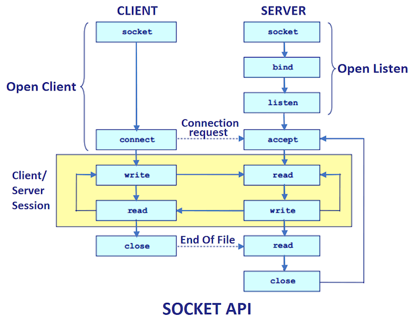

Lecture 13
---

# Sockets

## Lecture

Slides ([PDF](OS_Lecture_13.pdf), [PPTX](OS_Lecture_13.pptx)).

### Sockets

#### Socket

An abstraction for asynchronous data transfer:
* Has two ends
* Can be bidirectional
* Can be organized over a variety of underlying layers
* network; e. g. TCP, UDP etc. for IPv4 (_internet_ socket)
* special filesystem object; e.g. so-called _unix domain_ socket
* ...
* see [socket](https://man7.org/linux/man-pages/man2/socket.2.html)
  
### Socket Disciplines

#### Stream

An ordered series of packets of reliable data:
* No transfer without connection is established
* Data transferred is reliably equal to data received (including network packets corruption/loss/duplication correction)
* Out-of-band state are eliminated (sender can not send more than reciever can receive)

#### Datagram

A single message:
* No need to establish a connection
* When sending over a network, no need to order and count packets (because there is only one)

### Socket Programming

Probably it will be better to read the following text _in parallel_
with trying the examples below.

#### To initialize a socket

1. Create a
   [socket(domain, type, 0)](https://man7.org/linux/man-pages/man2/socket.2.html)
   * `domain` is underlying layer type (various networks, filesystem etc), aka _address family_
   * `type` is discipline (stream, datagram or others)

#### To run a server

1. Associate the socket with the specific address/location via
   [bind(socket, address, length)](https://man7.org/linux/man-pages/man2/bind.2.html)
   * `socket` is the _descriptor_ of the socket
   * `address` is domain-specific `struct` filled with actual address of the server
   * `length` is the address structure size
   * Because of various address families has different address size, we need to provide it
   * For the same reason, we need to cast actual structure type to `const struct sockaddr *`,
     which is merely a placeholder
1. Start to [listen(socket, queue_length)](https://man7.org/linux/man-pages/man2/listen.2.html)
   * if the number of unreceived streams/datagrams is equal to `queue_length`
   * all other stream connections are refused (sender got an error message)
   * all other datagrams are dropped (sender got nothing)
1. If the socket supports _connections_ (e.g. stream type socket),
   * socket given by `listen()` is _control socket_, used to accept _connections_
   * got a new connection _data socket_ descriptor returned by
     [accept(socket, address, &length)](https://man7.org/linux/man-pages/man2/accept.2.html)
       * `address` and `length` are filled with peer address and its address length
         (if we do not need them, we can use both NULL here)
   * Use _data socket_ to receive data
1. Receive a portion of data from data `socket` to `buffer` via
   [recv(data_socket, buffer, length, 0)](https://man7.org/linux/man-pages/man2/recv.2.html)
   * Datagram transmission has no control sockets, so the information about the sender address
     can be gathered by using [recvfrom(socket, buffer, length, 0, address, &length)](
     https://man7.org/linux/man-pages/man3/recvfrom.3p.html)
   * Stream transmission complies "file as stream" abstraction, so we can just use
     [read(socket, buffer, length)](https://man7.org/linux/man-pages/man2/read.2.html) instead
1. Do not forget to
   [close()](https://man7.org/linux/man-pages/man2/close.2.html) data the sockets after transmission is done
   * Also, close _control socket_ before finishing a service.
     Not closing TCP stream control makes its port unavailable for further use for next couple of minutes.

#### To run a client

1. Associate the socket with the specific _remote server_ address/location via
   [connect(socket, address, length)](
   https://man7.org/linux/man-pages/man2/connect.2.html) (see above for arguments explanation)
1. Send data to this server via [send(socket, buffer, length, 0)](
   https://man7.org/linux/man-pages/man2/send.2.html)
1. Do not forget to [close()](https://man7.org/linux/man-pages/man2/close.2.html) sockets after transmission is done

#### Datagram socket

When using a datagram socket,
we can use [sendto(socket, buffer, length, 0, address, &length)](
https://man7.org/linux/man-pages/man3/sendto.3p.html)
to send a single datagram instead of `connect()` and then `send()`.
No connection is established anyway, and `connect()` here serves only informational purpose.

When using stream socket, we can use [read(socket, buffer, length)](
https://man7.org/linux/man-pages/man2/read.2.html) as well.

### Examples

* [unix_d_send.c](
  https://github.com/andrewt0301/hse-acos-course/blob/master/docs/part2os/13_Sockets/unix_d_send.c)
* [unix_d_server.c](
  https://github.com/andrewt0301/hse-acos-course/blob/master/docs/part2os/13_Sockets/unix_d_server.c)
* [tcp_client.c](
  https://github.com/andrewt0301/hse-acos-course/blob/master/docs/part2os/13_Sockets/tcp_client.c)
* [tcp_qq_srver.c](
  https://github.com/andrewt0301/hse-acos-course/blob/master/docs/part2os/13_Sockets/tcp_qq_srver.c)
* [tcp_qq_srverS.c](
  https://github.com/andrewt0301/hse-acos-course/blob/master/docs/part2os/13_Sockets/tcp_qq_srverS.c)
* [tcp_server.c](
  https://github.com/andrewt0301/hse-acos-course/blob/master/docs/part2os/13_Sockets/tcp_server.c)

## Workshop

### Socket system calls

#### Common
* [socket](https://man7.org/linux/man-pages/man2/socket.2.html)
* [close](https://man7.org/linux/man-pages/man2/close.2.html)

#### Client
* [connect](https://man7.org/linux/man-pages/man2/connect.2.html)

#### Server
* [bind](https://man7.org/linux/man-pages/man2/bind.2.html)
* [listen](https://man7.org/linux/man-pages/man2/listen.2.html)
* [accept](https://man7.org/linux/man-pages/man2/accept.2.html)

#### Send/Receive

* [read](https://man7.org/linux/man-pages/man2/read.2.html)
* [write](https://man7.org/linux/man-pages/man2/write.2.html)
* [send](https://man7.org/linux/man-pages/man2/send.2.html)
* [recv](https://man7.org/linux/man-pages/man2/recv.2.html)

## Homework

__TODO__

# References

* [OSI model](https://en.wikipedia.org/wiki/OSI_model) (Wikipedia)
* [Internet protocol suite](https://en.wikipedia.org/wiki/Internet_protocol_suite) (Wikipedia)
