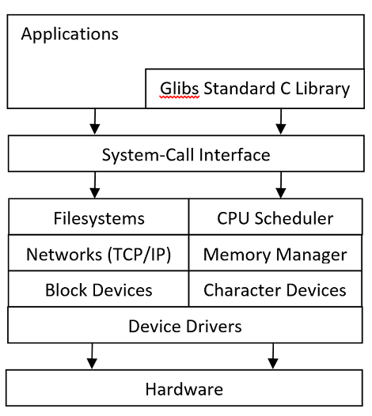

Seminar
---

# Linux Modules

## Operating System Architecture
In general words, an _operating system_ is a software that controls hardware
and provides an environment under which programs can run.
The software responsible for this task is commonly called a _kernel_.
In addition to the kernel, an operating system provides a set of _system programs_ that
solve different tasks of managing the operating system.

The interface to the kernel is called _system calls_.
System libraries and system software are built on the top of this interface.

The kernel solves the following main tasks:
* Process management
* Memory management
* Filesystem management
* Device control
* Networking

The structure of the Linux operating system looks like this:



Modern operating system solve many tasks and support a great number of various devices.
To simplify development and maintenance, operating systems must be carefully engineered.

There two opposite views on the structure of an operating system kernel:
_monolithic_ and _microkernel_.
The first implies that the kernel is a single library loaded in a single address space.
The second assumes that the kernel contains only a small set essential components,
while other components move to user-level programs.
This provides a better modularity,
but works must slower than a monolithic kernel as communication between
components located in different address spaces has a significant overhead.

Linux combines both of these approaches to provide good modularity and,
at the same time, to save performance.
The Linux kernels is loaded into a single address space,
but it consists of _modules_ that can be dynamically loaded to the kernel address space.

## Operating System Modules

In Linux, it is possible to extend at runtime the set of features provided by the kernel.
This means that it is allowed to add (and remove) functionality to the kernel while the operating system is running.
A piece of code added to the kernel at is called a _module_.

Linux kernel supports several types (classes) of modules including device drivers.
Each module is an object file (not linked into a complete executable)
that can be dynamically linked to the running kernel
by the [insmod](https://man7.org/linux/man-pages/man8/insmod.8.html) tool and can be unlinked
by the [rmmod](https://man7.org/linux/man-pages/man8/rmmod.8.html) tool.
Code of modules is executed in the kernel mode.

# Simple Module

The source code of a simple “Hello World” module looks as follows.

__hello.c__:

```c
#include <linux/init.h>
#include <linux/module.h>
 
MODULE_LICENSE("Dual BSD/GPL");
 
static int hello_init(void) {
    printk(KERN_ALERT "Hello, world\n");
    return 0;
}

static void hello_exit(void) {
    printk(KERN_ALERT "Goodbye, cruel world\n");
}
 
module_init(hello_init);
module_exit(hello_exit);
```

The module defines two functions `hello_init` and `hello_exit`.
The first is invoked when the module is loaded into the kernel and
the second is invoked when the module is removed.

The `module_init` and `module_exit` lines are special kernel macros
that indicate the role of these two functions.
Another special macro `MODULE_LICENSE` is used to tell that this module uses a free license.
Without this declaration, the kernel complains when the module is loaded.

The `printk` function prints a message to the Linux kernel log.
To build the module, the following Make file is required.

Makefile:
```
obj-m += hello.o
all:
	make -C /lib/modules/$(shell uname -r)/build M=$(PWD) modules
clean:
	make -C /lib/modules/$(shell uname -r)/build M=$(PWD) clean
```

The module is built with the following command:
```bash
acos@acos-vm:~/seminar2$ make
make -C /lib/modules/5.4.0-52-generic/build M=/home/acos/seminar2 modules
make[1]: Entering directory '/usr/src/linux-headers-5.4.0-52-generic'
CC [M] /home/acos/seminar2/hello.o
Building modules, stage 2.
MODPOST 1 modules
CC [M] /home/acos/seminar2/hello.mod.o
LD [M] /home/acos/seminar2/hello.ko
make[1]: Leaving directory '/usr/src/linux-headers-5.4.0-52-generic'
```

The module can be installed and removed with the help of the following commands:
```bash
acos@acos-vm:/seminar2$ sudo insmod ./hello.ko
acos@acos-vm:/seminar2$ sudo rmmod hello
acos@acos-vm:~/seminar2$ sudo dmesg
[19179.657083] Hello, world
[19190.587959] Goodbye, cruel world
```

The [dmesg](https://man7.org/linux/man-pages/man1/dmesg.1.html)
command is used to print the kernel ring buffer, which contains messages printed by printk.

### Task 01:

The Linux kernel keeps track of the number of timer interrupts that have occurred since the system was booted.
This value is stored in the `jiffies` variable declared in the file `<linux/jiffies.h>`.
Write a module that prints the value of the `jiffies` variable before installing and removing this module.
All printing should be done on module exit.

__simple_time.c (solution):__

```c
#include <linux/init.h>
#include <linux/jiffies.h>
#include <linux/module.h>

MODULE_LICENSE("Dual BSD/GPL");

unsigned long start;

static int simple_init(void) {
    start = jiffies;
    printk(KERN_ALERT "Module is installed\n");
    return 0;
}

static void simple_exit(void) {
    unsigned long end = jiffies;
    printk(KERN_ALERT "Module is removed\n");
    unsigned long delta = end - start;
    printk(KERN_ALERT "Jiffies start time: %lu\n", start);
    printk(KERN_ALERT "Jiffies end time: %lu\n", end);
    printk(KERN_ALERT "Jiffies elapsed time: %lu\n", delta);
}

module_init(simple_init);
module_exit(simple_exit);
```

__Makefile (solution):__

```
obj-m += simple_time.o
all:
    make -C /lib/modules/$(shell uname -r)/build M=$(PWD) modules
clean:
    make -C /lib/modules/$(shell uname -r)/build M=$(PWD) clean
```

The commands that must be executed to build, install, and remove the module:

```bash
acos@acos-vm:~/seminar2$ su
Password:
root@acos-vm:/home/acos/seminar2# make
make -C /lib/modules/5.4.0-52-generic/build M=/home/acos/seminar2 modules
make[1]: Entering directory '/usr/src/linux-headers-5.4.0-52-generic'
Building modules, stage 2.
MODPOST 1 modules
make[1]: Leaving directory '/usr/src/linux-headers-5.4.0-52-generic'
root@acos-vm:/home/acos/seminar2# insmod simple_time.ko
root@acos-vm:/home/acos/seminar2# rmmod simple_time.ko
root@acos-vm:/home/acos/seminar2# dmesg
[20647.100079] Module is installed
[20654.151853] Module is removed
[20654.151857] Jiffies start time: 4300054039
[20654.151857] Jiffies end time: 4300055802
[20654.151858] Jiffies elapsed time: 1763
```

### Task 02:

Implement a kernel module that creates a virtual file named `/proc/jiffies` that provides
the current value of the `jiffies` variable when the `/proc/jiffies` file is read.
The simplest way to read the file is to execute this command:

```bash
cat /proc/jiffies
```
The file `/proc/jiffies` must be removed when the module is removed.

__jiffies.c (solution):__

```c
#include <linux/init.h>
#include <linux/jiffies.h>
#include <linux/kernel.h>
#include <linux/module.h>
#include <linux/proc_fs.h>
#include <asm/uaccess.h>

#define BUFFER_SIZE 128
#define PROC_NAME "jiffies"

ssize_t proc_read(
    struct file *file,
    char __user *usr_buf,
    size_t count,
    loff_t *pos
);

static struct file_operations proc_ops = {
    .owner = THIS_MODULE,
    .read = proc_read,
};

// This function is called when the module is loaded.
int proc_init(void) {
    // creates the /proc/jiffies entry
    proc_create(PROC_NAME, 0666, NULL, (const struct proc_ops *) &proc_ops);
    return 0;
}

// This function is called when the module is removed.
void proc_exit(void) {
    // removes the /proc/jiffies
    remove_proc_entry(PROC_NAME, NULL);
}

// This function is called each time /proc/jiffies is read.
ssize_t proc_read(
        struct file *file,
        char __user *usr_buf,
        size_t count,
        loff_t *pos) {
    int rv = 0;
    char buffer[BUFFER_SIZE];
    static int completed = 0;
    if (completed) {
    completed = 0;
        return 0;
    }
    completed = 1;
    rv = sprintf(buffer, "Jiffies time: %lu\n", jiffies);
    raw_copy_to_user(usr_buf, buffer, rv);
    return rv;
}

module_init(proc_init);
module_exit(proc_exit);
```

Take notice of the `proc_create` and `remove_proc_entry` functions.
They are used to create and remove an entry in the `/proc` virtual filesystem.
The `proc_read` function implemented in the module returns the requests data when the file is read.
The `raw_copy_to_user` function is used to copy data from the kernel to the user address space.

__Makefile (solution)__:
```
obj-m += jiffies.o
all:
    make -C /lib/modules/$(shell uname -r)/build M=$(PWD) modules
clean:
    make -C /lib/modules/$(shell uname -r)/build M=$(PWD) clean
```

This is how the module is built, installed, used, and removed:
```bash
acos@acos-vm:/seminar2_2$ make
make -C /lib/modules/5.4.0-52-generic/build M=/home/acos/seminar2_2 modules
make[1]: Entering directory '/usr/src/linux-headers-5.4.0-52-generic'
CC [M] /home/acos/seminar2_2/jiffies.o
Building modules, stage 2.
MODPOST 1 modules
CC [M] /home/acos/seminar2_2/jiffies.mod.o
LD [M] /home/acos/seminar2_2/jiffies.ko
make[1]: Leaving directory '/usr/src/linux-headers-5.4.0-52-generic'
acos@acos-vm:/seminar2_2$ sudo insmod jiffies.ko
[sudo] password for acos:
acos@acos-vm:/seminar2_2$ cat /proc/jiffies
Jiffies time: 4300516527
acos@acos-vm:/seminar2_2$ cat /proc/jiffies
Jiffies time: 4300516867
acos@acos-vm:/seminar2_2$ cat /proc/jiffies
Jiffies time: 4300517617
acos@acos-vm:/seminar2_2$ sudo rmmod jiffies
```

## Homework

Finish all the tasks unfinished in the class.
The tasks with solutions are in the above sections.
