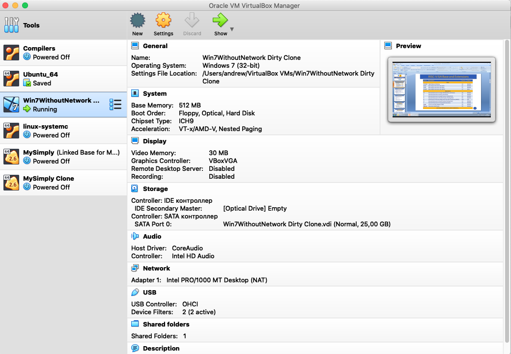
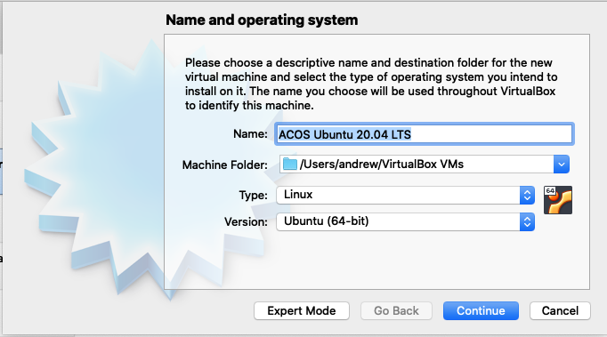
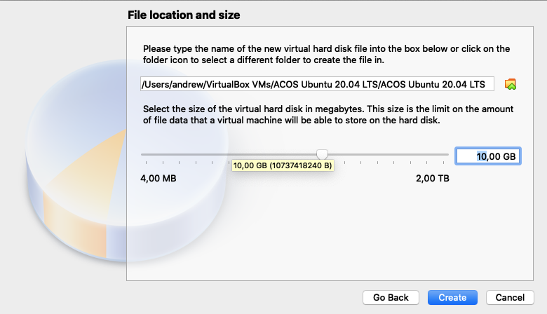
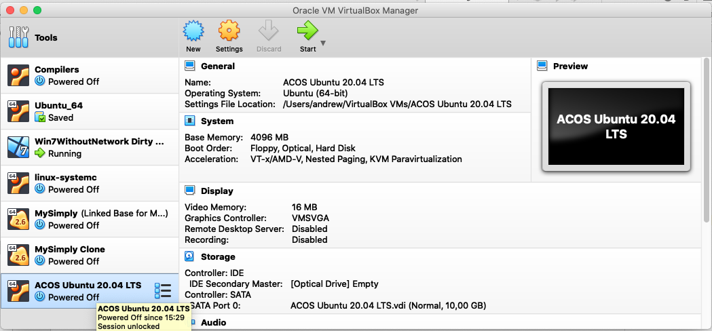
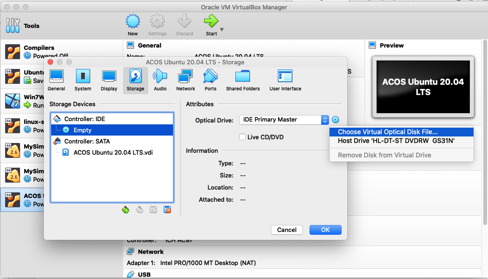
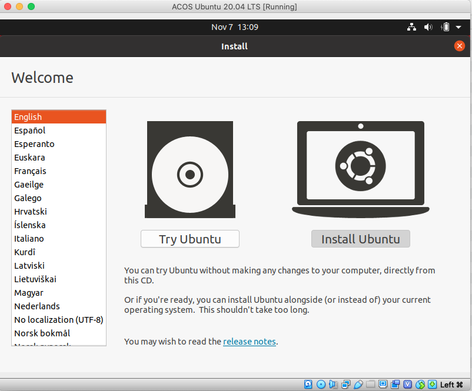
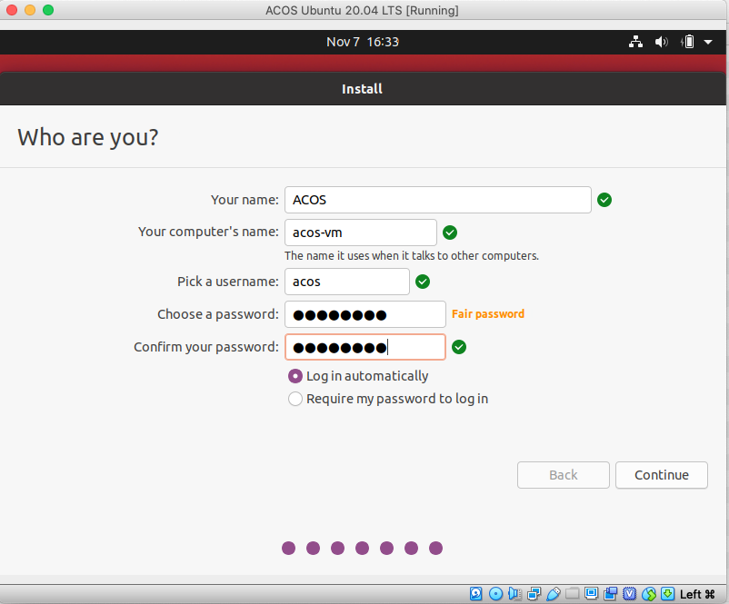
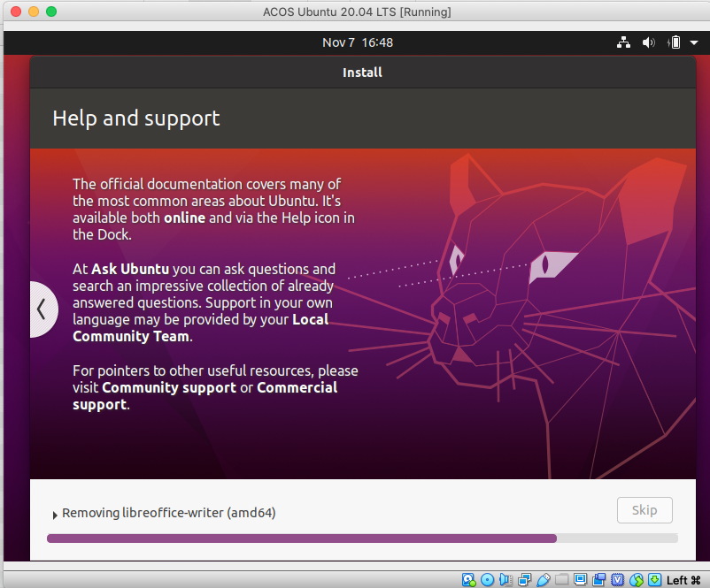

Install Linux Ubuntu and Related Tools
---

# Installing Ubuntu in VirtualBox

1. Run VirtualBox in your laptop.
1. Click the "New" button in the VirtualBox toolbar.
     
1. In the dialog specify machine name as "ACOS Ubuntu 20.04 LTS" and click "Continue".
   
1. Allocate for the new virtual machine 4096 MB of RAM (well, at least 2048). Click "Continue".
1. Select "Create a virtual hard disk now" and click "Create".
1. Specify hard disk file type as "VDI (VirtualBox Disk Image)" and click "Continue".
1. Specify storage on physical hard disk as "Dynamically allocated" and click "Continue".
1. Specify file location and size for the virtual disk and press "Continue". Recommended size is 10 GB.
   
1. Now the virtual machine is create. The next step is to install Linux Ubuntu.
   
1. Select the "ACOS Ubuntu 20.04 LTS" virtual machine and clink "Settings" in the toolbar.
1. Go to the "Storage" page of the dialog and select virtual optical disk file.
   
1. Select the downloaded Linux Ubuntu distribution (with the `.iso` extension) and click "OK".
1. Select the "ACOS Ubuntu 20.04 LTS" virtual machine and clink "Start" in the toolbar.
1. VirtualBox will rung the virtual machine, which will start loading the Linux Ubuntu distribution.
1. When the installer is loaded, click in the virtual machine window "Install Ubuntu".
   
1. Select "English (US)" for the keyboard layout and click "Continue".
1. Select "Minimal installation" and click "Continue". We do not need a full installation. Many tools are useless for us. Later we can install tools that we need.
1. Select installation type as "Erase disk and install Ubuntu" and click "Install Now".
1. In the appearing "Write the changes to disk?" dialog, click "Continue".
1. In the "Where are you?" dialog, specify "Moscow" and click "Continue".
1. Specify user name as "ACOS", computer name as "acos-vm", and password as "acos2020" (or as you wish). Click "Continue".
   
1. Wait for Ubuntu to be installed. This will take about 40 minutes.
   

___TODO__
