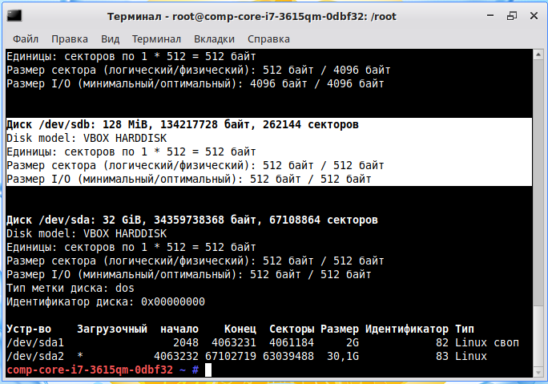

Services
---

For some theory, see [Managing Services with systemd](
https://access.redhat.com/documentation/en-us/red_hat_enterprise_linux/7/html/system_administrators_guide/chap-managing_services_with_systemd)
by RedHat.

## Mounting a disk with systemd

1. Create a new Virtual Disk in VirtualBox.

2. Boot the Virtual Machine.

3. See the created disk.
 
       su -
       fdisk -l

