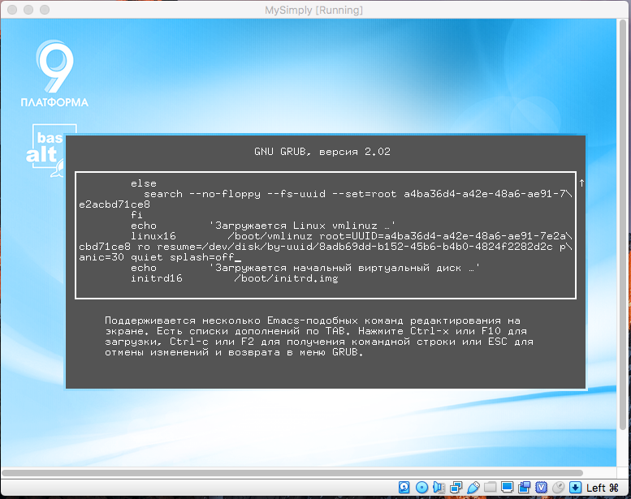
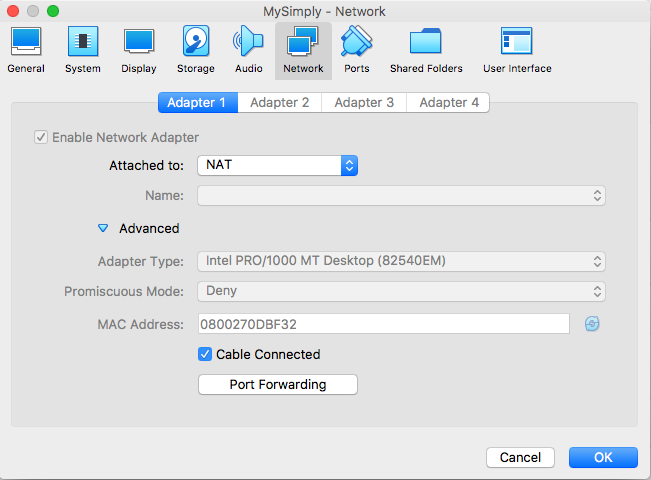

Working with Simply Linux in VirtualBox
---

# Install Simply Linux

Tasks done in this seminar involve modification of the system configuration.
Live CD does not allow this. So, you need to install Simply Linux on your disk.

Please follow these guidelines:

https://uneex.ru/HSE/ArchitectureOS/03_PreSystemBoot/SimplyLinuxInatallation 

# Modify GRUB settings

1. Start Simply Linux in VirtualBox.
2. Press key 'e' to edit GRUB settings.
2. Replace 'splash' with 'splash=off'.
3. Press key 'F10' to boot the system.

Now the splash screen will be not shown when the system is booting.

After logging in, see GRUB settings:

    [andrewt@comp-core-i7-3615qm-0dbf32 ~]$ sudo cat /boot/grub/grub.cfg | grep splash
        linux16	/boot/vmlinuz root=UUID=a4ba36d4-a42e-48a6-ae91-7e2acbd71ce8 ro
                resume=/dev/disk/by-uuid/8adb69dd-b152-45b6-b4b0-4824f2282d2c panic=30 quiet splash
            linux16	/boot/vmlinuz root=UUID=a4ba36d4-a42e-48a6-ae91-7e2acbd71ce8 ro
                resume=/dev/disk/by-uuid/8adb69dd-b152-45b6-b4b0-4824f2282d2c panic=30 quiet splash
            linux16	/boot/vmlinuz-5.4.28-std-def-alt1 root=UUID=a4ba36d4-a42e-48a6-ae91-7e2acbd71ce8 ro
                resume=/dev/disk/by-uuid/8adb69dd-b152-45b6-b4b0-4824f2282d2c panic=30 quiet splash

    [andrewt@comp-core-i7-3615qm-0dbf32 ~]$ cat /proc/cmdline 
    BOOT_IMAGE=/boot/vmlinuz root=UUID=a4ba36d4-a42e-48a6-ae91-7e2acbd71ce8 ro
    resume=/dev/disk/by-uuid/8adb69dd-b152-45b6-b4b0-4824f2282d2c panic=30 quiet splash

# Set up port forwarding

After Simply Linux is installed in your VirtualBox, please make that the network
interface is enabled and set up port forwarding. We need to forwarding for port 22
in order to be able to connect to Simply Linux VM using SSH. 

# Run SSH service in Simply Linux

Check status of the 'sshd' service:

    systemctl status sshd
    
Start the service:

    systemctl start sshd

Stop the service:

    systemctl stop sshd

Enable the service by default:

    sudo systemctl enable sshd

# Connect to Simply Linux using SSH

    ssh andrewt@localhost -p2022

# Create a new user

Get current user information:

    [andrewt@comp-core-i7-3615qm-0dbf32 ~]$ whoami
    andrewt

    [andrewt@comp-core-i7-3615qm-0dbf32 ~]$ id
    uid=500(andrewt) gid=500(andrewt) группы=500(andrewt),10(wheel),14(uucp),19(proc),22(cdrom),
    71(floppy),80(cdwriter),81(audio),83(radio),457(vboxusers),458(sambashare),463(camera),
    471(video),498(xgrp),499(scanner)

    [andrewt@comp-core-i7-3615qm-0dbf32 ~]$ echo $PATH
    /home/andrewt/bin:/bin:/usr/bin:/usr/local/bin:/usr/games

Switch to super user and see user information:

    [andrewt@comp-core-i7-3615qm-0dbf32 ~]$ su -
    Password:
 
    [root@comp-core-i7-3615qm-0dbf32 ~]# whoami
    root

    [root@comp-core-i7-3615qm-0dbf32 ~]# id
    uid=0(root) gid=0(root) группы=0(root),1(bin),2(daemon),3(sys),4(adm),6(disk),10(wheel),19(proc)
    
    [root@comp-core-i7-3615qm-0dbf32 ~]# echo $PATH
    /root/bin:/sbin:/usr/sbin:/usr/local/sbin:/bin:/usr/bin:/usr/local/bin

Switch back to initial user can be done this way:

    [root@comp-core-i7-3615qm-0dbf32 ~]# su - andrewt
    [andrewt@comp-core-i7-3615qm-0dbf32 ~]$ 

Create a new user:

    [root@comp-core-i7-3615qm-0dbf32 ~]# adduser -c "New User" newuser
    [root@comp-core-i7-3615qm-0dbf32 ~]# 

Set password for the new user:

    [root@comp-core-i7-3615qm-0dbf32 ~]# passwd newuser
    passwd: updating all authentication tokens for user newuser.

    You can now choose the new password or passphrase.
    
    A valid password should be a mix of upper and lower case letters,
    digits, and other characters.  You can use a password
    that consists of 8 characters from at least 3 of these 4 classes, or
    
    a password containing 7 characters from all the classes.
    An upper case letter that begins the password and a
    digit that ends it do not count towards the number of character
    classes used.
    
    A passphrase should be of at least 3 words, 11 to 40 characters
    long, and contain enough different characters.
    
    Alternatively, if no one else can see your terminal now, you can
    pick this as your password: "Molten_chose-macho".
    
    Enter new password: 
    Re-type new password: 
    passwd: all authentication tokens updated successfully.
    [root@comp-core-i7-3615qm-0dbf32 ~]# 

See information about the new user:

    [andrewt@comp-core-i7-3615qm-0dbf32 ~]$ cat /etc/passwd | grep newuser
    newuser:x:501:501:New User:/home/newuser:/bin/bash

Switch to the new user:

    [root@comp-core-i7-3615qm-0dbf32 ~]# su - newuser
    [newuser@comp-core-i7-3615qm-0dbf32 ~]$ 

    [newuser@comp-core-i7-3615qm-0dbf32 ~]$ id
    uid=501(newuser) gid=501(newuser) группы=501(newuser)

Then switch to root:

    [newuser@comp-core-i7-3615qm-0dbf32 ~]$ su -
    -bash: /bin/su: Отказано в доступе

    [newuser@comp-core-i7-3615qm-0dbf32 ~]$ ls -l /bin/su
    -rws--x--- 1 root wheel 27520 янв 16  2017 /bin/su

Log in using a new terminal and give 'newuser' rights (add to group):

    [root@comp-core-i7-3615qm-0dbf32 ~]# usermod -a -G wheel newuser
    [root@comp-core-i7-3615qm-0dbf32 ~]# su - newuser
    
Check group membership:

    [newuser@comp-core-i7-3615qm-0dbf32 ~]$ id
    uid=501(newuser) gid=501(newuser) группы=501(newuser),10(wheel)

    [root@comp-core-i7-3615qm-0dbf32 ~]# cat /etc/group | grep newuser
    wheel:x:10:root,andrewt,newuser
    newuser:x:501:

Make sure the access is granted:

    [newuser@comp-core-i7-3615qm-0dbf32 ~]$ su -
    Password: 
    [root@comp-core-i7-3615qm-0dbf32 ~]#

# Homework

1. Save the contents of the `/proc/cmdline` file in the `04_VirtualBox2` folder
   at the `sugon` server.

2. Save the output of the `systemctl status sshd` command to a text file in the `04_VirtualBox2`
   folder at the `sugon` server.

3. Save the `/etc/group` and `/etc/passwd` files in the `04_VirtualBox2` folder
   at the `sugon` server.

To copy files to a folder on a remote server, use the 'scp' command: 

    scp /path/to/local/file username@hostname:/path/to/remote/file

    scp username1@hostname1:/path/to/file username2@hostname2:/path/to/other/file
